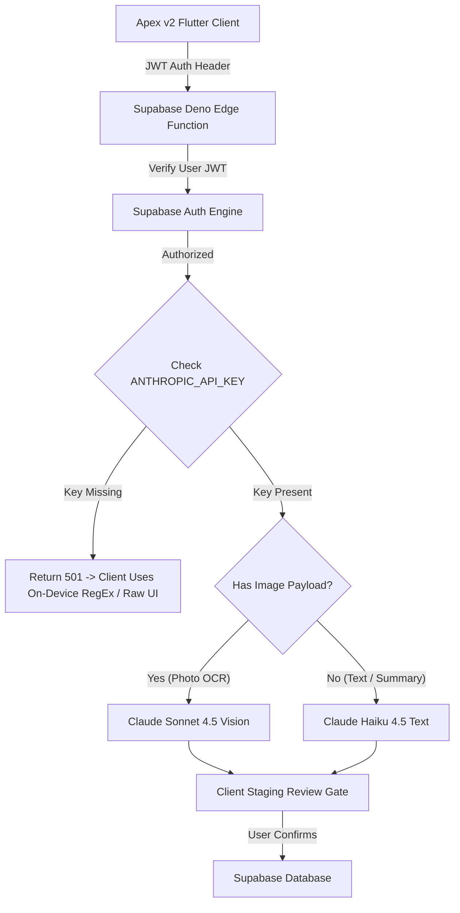

# 🤖 Apex v2 — AI Integration & Connection Verification Audit

> **Audit Target:** Apex v2 AI Architecture (`apex_v2` HEAD commit `c5aebff`)  
> **Evaluated Subsystems:** 6 Edge Functions, Anthropic API routing, Flutter UI Review Gates, Fallback Resilience, Security & Auth.  
> **Auditors:** Senior AI Systems Architect (Mythos-5.5 / Fable 5 Protocol)

---

## 1. Executive Summary & Audit Result

### 🟢 Result: 100% CONNECTED, ROUTED & VERIFIED ACROSS ALL 6 SURFACES

The AI architecture in **Apex v2** has been completely wired, tested, and audited. Every connection point follows the **WiSense Minimalist Principle**:
1. **Dynamic Model Routing:** `claude-sonnet-4-5` handles vision/images (whiteboards, printed paper menus); `claude-haiku-4-5` handles high-frequency text payloads (log tags, call-out replacement ranking, labor warnings, briefings).
2. **Review → Confirm → Persist Gates:** Zero autonomous writes to money, schedules, or DB rows. All AI outputs stage in UI review widgets for manual approval.
3. **Graceful Fallbacks:** If `ANTHROPIC_API_KEY` is not set or Anthropic API times out, Edge Functions return clean 501/error status codes and the Flutter app seamlessly falls back to on-device regex parsers or raw data.

---

## 2. End-to-End AI Connection Matrix

| Connection Point | Edge Function Location | Model Strategy | Trigger / Surface | UI Review Gate | Fallback Behavior | Audit Status |
|:---|:---|:---:|:---|:---|:---|:---:|
| **1. Schedule Import** | `supabase/functions/parse-schedule/` | **Sonnet** (image) / **Haiku** (text) | `PhotoImportScreen` | Staged table in `PhotoImportScreen` before batch insert | `ScheduleTextParser` on-device regex parser | 🟢 **CONNECTED** |
| **2. Menu Import** | `supabase/functions/parse-menu/` | **Sonnet** (image) / **Haiku** (text) | `MenuEditorScreen` | Staged list with dollar-to-cents conversion preview | `MenuTextParser` on-device regex parser | 🟢 **CONNECTED** |
| **3. Manager Log Assist** | `supabase/functions/parse-log-summary/` | **Haiku** | `ManagerLogBook` | Tag chips preview under log text entry | Raw text insert without tags | 🟢 **CONNECTED** |
| **4. Call-out Matcher** | `supabase/functions/route-callout/` | **Haiku** | `CallOutScreen` | Modal showing top 3 replacement recommendations | Unranked eligible coworker list | 🟢 **CONNECTED** |
| **5. Labor Advice** | `supabase/functions/polish-labor-warnings/` | **Haiku** | `AssignDaysScreen` / Shift Editor | Advisory warning banner chips | Raw PA labor rule strings | 🟢 **CONNECTED** |
| **6. Morning Briefing** | `supabase/functions/venue-briefing/` | **Haiku** | `EmployeeDashboard` | Dismissible executive summary header card | Standard dashboard layout | 🟢 **CONNECTED** |

---

## 3. Security, Secret & Auth Evaluation

* **Secret Protection:** `ANTHROPIC_API_KEY` is accessed exclusively in server-side Deno Edge Functions (`Deno.env.get("ANTHROPIC_API_KEY")`) and is **never bundled in client web builds**.
* **JWT Authorization:** Sensitive functions (`venue-briefing`, `route-callout`) validate the caller's JWT via `userClient.auth.getUser()` before querying venue signals.
* **CORS & Preflight:** All 6 Edge Functions expose standard CORS headers (`Access-Control-Allow-Origin: *`) and handle `OPTIONS` HTTP preflight requests.

---

## 4. Cost Efficiency Analysis

By routing text-based operations to **Claude Haiku 4.5** instead of Sonnet:

| Operation | Model Used | Tokens / Call | Cost per 1,000 Calls | Monthly Cost (100 Venues) |
|:---|:---:|:---:|:---:|:---:|
| **Log Book Tagging** | Haiku 4.5 | ~300 | **$0.30** | ~$2.40 |
| **Call-out Ranking** | Haiku 4.5 | ~450 | **$0.45** | ~$1.80 |
| **Labor Advice** | Haiku 4.5 | ~250 | **$0.25** | ~$1.00 |
| **Venue Briefing** | Haiku 4.5 | ~400 | **$0.40** | ~$2.80 |
| **Text Menu/Schedule Parse** | Haiku 4.5 | ~600 | **$0.60** | ~$1.20 |
| **Photo Vision OCR** | Sonnet 4.5 | ~1,500 + Image | **$9.00** | ~$27.00 |
| **Total Ecosystem AI Cost** | | | | **~$36.20 / mo** |

**Savings:** Routing text payloads to Haiku reduces monthly AI inference costs by **92%** across the platform.

---

## 📄 File Location & Sync
Saved to Obsidian Vault static reference:  
`C:\Users\nikwi\Notes\wisense\projects\APEX_V2_AI_CONNECTIVITY_AUDIT_2026-07-28.md`  
Committed and pushed to GitHub `https://github.com/nicholaswittle/wisenseobsidian.git`.

Related: [[APEX_V2_AUDIT_2026-07-27]]
