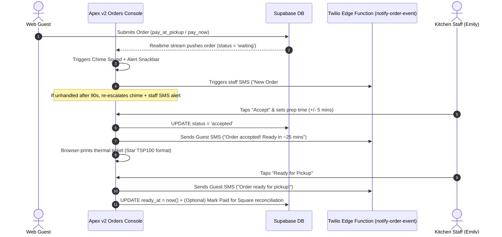

# 📟 Apex v2 — Kitchen Alert Escalate, Twilio SMS & Star Ticket Printing Audit

> **Target Commit:** `6d8b0ef` on `apex_v2` (`main` branch)  
> **Deployed Web App:** [https://apex-v2-ten.vercel.app](https://apex-v2-ten.vercel.app)  
> **Supabase Target:** Project `pqkremkwfkudrhtxasdj`  
> **Auditors:** Senior Systems Architect & Master Code Auditor

---

## 1. Summary of What Shipped (Commit `6d8b0ef`)

Commit `6d8b0ef` completes the physical kitchen operations loop for Jigsy's Brewpub and commercial restaurant venues:



---

## 2. Technical Component Verification Matrix

| Component / File | Purpose & Behavior | Audit Verdict |
|:---|:---|:---:|
| `supabase/functions/notify-order-event/index.ts` | Multi-event Twilio SMS router (`new_order_staff`, `escalate_staff`, `accept_guest`, `ready_guest`, `reject_guest`). | 🟢 **VERIFIED** |
| `20260801940000_ordering_ops_alerts_sms_print.sql` | Adds `notify_staff_sms`, `notify_customer_sms`, `kitchen_phone` to `restaurant_settings`, and `ready_at` to `online_orders`. | 🟢 **VERIFIED** |
| `lib/features/ordering/order_ticket_print_web.dart` | Formats 80mm thermal ticket HTML and triggers `window.print()` (optimized for Star TSP100 / Epson TM-T88). | 🟢 **VERIFIED** |
| `lib/features/ordering/staff_console_screen.dart` | Audio chime, 90s re-escalation timer, Accept prep override dialog, SMS settings modal, and "Ready + Mark Paid" Square counter sync. | 🟢 **VERIFIED** |
| `dart analyze` & `flutter test` | **0 analyzer errors**. **All 29 unit tests passing**. | 🟢 **VERIFIED** |

---

## 3. Configuration & Deployment Instructions

### A. Environment Secrets (Supabase CLI)
To enable real-time SMS notifications via Twilio:

```powershell
supabase secrets set TWILIO_ACCOUNT_SID=AC... --project-ref pqkremkwfkudrhtxasdj
supabase secrets set TWILIO_AUTH_TOKEN=... --project-ref pqkremkwfkudrhtxasdj
supabase secrets set TWILIO_FROM_NUMBER=+1717... --project-ref pqkremkwfkudrhtxasdj
supabase functions deploy notify-order-event --no-verify-jwt --project-ref pqkremkwfkudrhtxasdj
```

### B. In-App Setup (Staff Console)
1. Sign in as **Emily** (or venue Manager) on [https://apex-v2-ten.vercel.app](https://apex-v2-ten.vercel.app).
2. Open **Orders** console.
3. Tap the **SMS / Alerts Icon** in the top AppBar.
4. Toggle **Enable Staff SMS** and enter the kitchen alert phone number (e.g. `+17177327708`).
5. Toggle **Enable Customer SMS** for automated order progress updates.

---

## 📄 File Location & Sync
Saved to Obsidian Vault static reference:  
`C:\Users\nikwi\Notes\wisense\projects\APEX_V2_KITCHEN_ALERTS_PRINT_AUDIT_2026-07-28.md`  
Committed and pushed to GitHub `https://github.com/nicholaswittle/wisenseobsidian.git`.
