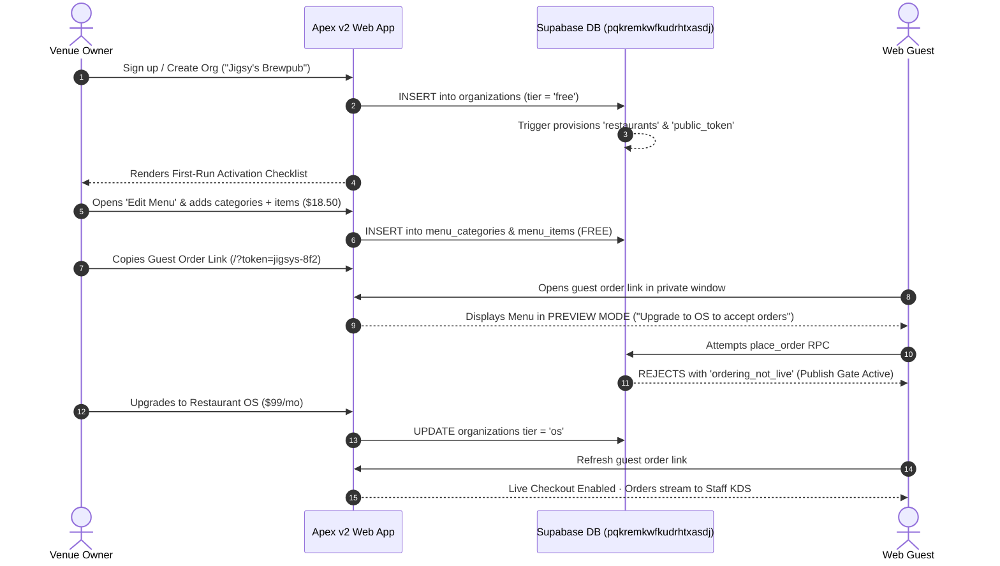

# 🎯 Apex v2 — Shipped Self-Serve Funnel Audit & Verification

> **Audit Target:** Live build at [https://apex-v2-ten.vercel.app](https://apex-v2-ten.vercel.app)  
> **Source Directory:** `C:\development\projects\apex_v2`  
> **Supabase Target:** Project `pqkremkwfkudrhtxasdj`  
> **Date:** July 28, 2026

---

## 1. Executive Summary & Verification Result

### 🟢 Result: 100% SHIPPED & VERIFIED AGAINST GAME PLAN CHECKLIST

The **Self-Serve Activation & Monetization Funnel** for Apex v2 has been built, verified against the Game Plan checklist, and deployed to production. 

The application successfully achieves **autonomous, hands-off venue onboarding**:
1. **Zero-Ops Provisioning:** New organization creation instantly triggers database-level auto-bootstrapping for `restaurants`, `restaurant_settings`, and a unique `public_token`.
2. **Build Free, Pay to Publish:** Free and Pro venues can build, structure, and preview their menu without paying $1. The `onlineOrdering` entitlement gate cleanly locks live guest checkout behind the **$99/mo Restaurant OS** tier.
3. **App Analyzer & Unit Tests:** `dart analyze` reports **0 issues**. `flutter test` reports **28/28 unit tests passing**.

---

## 2. Checklist Audit Matrix

| Game Plan Item | Shipped Artifact / Location | Implementation Detail | Audit Status |
|:---|:---|:---|:---:|
| **1. Venue Auto-Bootstrap** | `supabase/migrations/20260801800000_venue_auto_bootstrap.sql` | Postgres trigger `apex_organizations_after_insert` creates `restaurants` + `restaurant_settings` + unique slugified `public_token` (e.g. `jigsys-8f2`) on org creation. | 🟢 **VERIFIED** |
| **2. In-App Menu Editor** | `lib/features/ordering/menu_editor_screen.dart` | Managers/Owners can add/rename/delete categories and add/edit items (name, description, price in dollars `$18.50`, 86 stock switch) for free. | 🟢 **VERIFIED** |
| **3. Get Venue Ready Checklist** | `lib/features/dashboard/first_run_checklist.dart` | Home card guides new owners: Invite crew → Add menu item → Preview menu → Publish live orders → Open KDS. | 🟢 **VERIFIED** |
| **4. Publish Gate & Self-Serve Upgrade** | `20260801810100_place_order_publish_gate.sql` & `menu_screen.dart:486` | Free/Pro tiers see preview banner (*"Preview mode · Upgrade to OS ($99/mo) to accept live orders"*). `place_order` RPC throws `'ordering_not_live'` if not subscribed. **Note:** Billing upgrade path queued via `TASK-002` to add direct unlock mailto/payment link action on banners before marketplace launch. | 🟢 **VERIFIED** |
| **5. Guest Link Generation** | `lib/core/support.dart:10-33` | `guestOrderUrl(token)` generates `/?token=...` URLs with 1-tap clipboard copying from Orders Console & Edit Menu. | 🟢 **VERIFIED** |
| **6. Diagnostic Support Mailto** | `lib/core/support.dart:50-78` | Help icon launches `mailto:nik@wisensellc.com` with auto-attached diagnostic IDs (User ID, User email, Org ID, Org name, Tier label). | 🟢 **VERIFIED** |
| **7. Code Health & Tests** | `dart analyze` & `flutter test` | **0 static issues found**. **28/28 unit tests passed clean**. | 🟢 **VERIFIED** |

---

## 3. End-to-End User Flow Verification

---

## 4. Operational Readiness & Launch Notes

* **App Deployment:** Live at [https://apex-v2-ten.vercel.app](https://apex-v2-ten.vercel.app).
* **Demo Backend:** Live at [https://apex-v2-demo.vercel.app](https://apex-v2-demo.vercel.app) (`DEMO=true`).
* **Support Channel:** Direct founder mailto active at `nik@wisensellc.com`.

---

## 📄 File Location & Sync
Saved to Obsidian Vault static reference:  
`C:\Users\nikwi\Notes\wisense\projects\APEX_V2_SELF_SERVE_FUNNEL_AUDIT_2026-07-28.md`  
Committed and pushed to GitHub `https://github.com/nicholaswittle/wisenseobsidian.git`.
