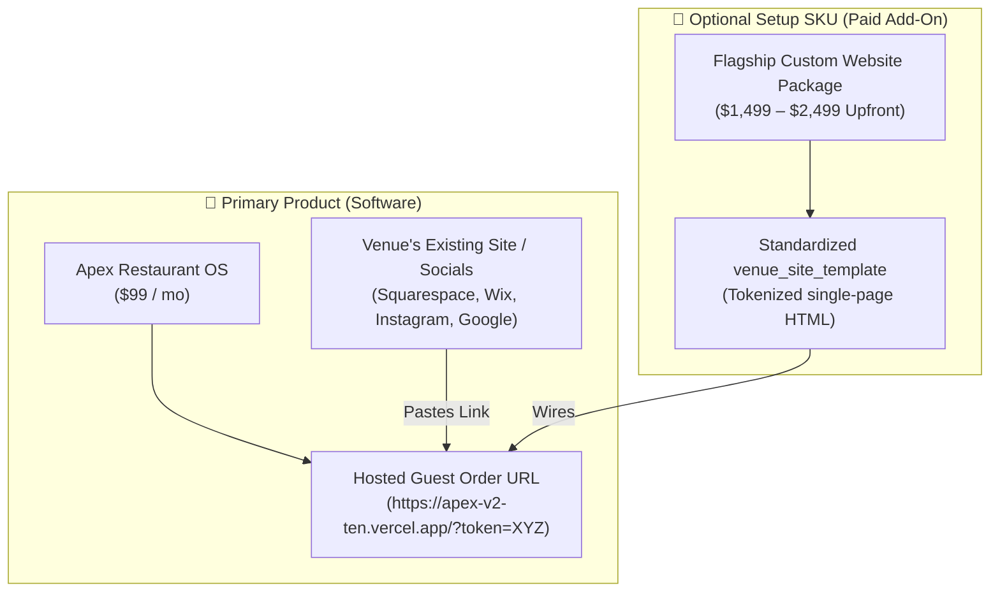

# 🛡️ WiSense Restaurant OS — Setup SKU & Flagship Positioning Strategy

> **Core Positioning Rule:** WiSense is a **Software Product Company**, not a web agency. The core product is the **Restaurant OS ($99/mo) accessed via hosted token URLs (`/?token=PUBLIC_TOKEN`)**. Custom website builds are sold strictly as an optional **"Flagship Setup SKU" ($1,499–$2,499 upfront)**, never as the default path into the OS.

---

## 1. Product vs. Setup SKU Matrix

| Dimension | Option A: Primary Product (Default) | Option B: Flagship Setup SKU (Paid Add-On) |
|:---|:---:|:---:|
| **Positioning** | **Apex Restaurant OS** | **Flagship Setup Package** |
| **Upfront Fee** | **$0** (Self-serve) | **$1,499 – $2,499** (One-time) |
| **Monthly Fee** | **$99 / mo** | **$99 / mo** |
| **Guest Door** | Venue pastes guest URL on existing site / socials | WiSense deploys custom single-page website |
| **Founder Ops Load** | **0 Hours (Hands-Off)** | **3–4 Hours per setup** |
| **Capacity Cap** | Unlimited venues | **Hard Cap: Max 3 per month** |

---

## 2. Fulfillment Realities & Capacity Governance

1. **Aspirational Floor vs. Execution Reality:**  
   While 90 minutes is the target floor for swapping CSS tokens, real-world fulfillment (client photo formatting, custom copy tweaks, domain DNS propagation, and menu verification) typically takes **3–4 hours**.
2. **Prerequisite Before Taking Paid Flagship Jobs:**  
   Extract a clean, dedicated `venue_site_template` repository from `jigsys_site` with standardized placeholders:
   - CSS variables: `--sauce`, `--crust`, `--ground`
   - Content tokens: `VENUE_NAME`, `PHONE`, `ADDRESS`, `HOURS_JSON`
   - Integration token: `PUBLIC_TOKEN`
3. **Capacity Hard Cap & Dynamic Surge Pricing:**  
   - Hard cap of **maximum 3 Flagship setups per month** to prevent founder time bankruptcy.
   - When monthly setup slots fill or demand surges, immediately increase price from **$1,499 → $2,499**.

---

## 3. Mandatory Rules for Monetization

* **Self-Serve Unlock Button is Non-Negotiable:** Flagship upfront cash flow does **not** replace the self-serve Stripe OS unlock button (`TASK-002`). The $99/mo self-serve funnel must run autonomously 24/7.
* **The OS Link is Always the Token URL:** The website is optional packaging; the OS link is always `https://apex-v2-ten.vercel.app/?token=PUBLIC_TOKEN`.

---

## 📄 File Location & Sync
Saved to Obsidian Vault static reference:  
`C:\Users\nikwi\Notes\wisense\projects\APEX_V2_AGENCY_UPSELL_STRATEGY_2026-07-28.md`  
Committed and pushed to GitHub `https://github.com/nicholaswittle/wisenseobsidian.git`.
