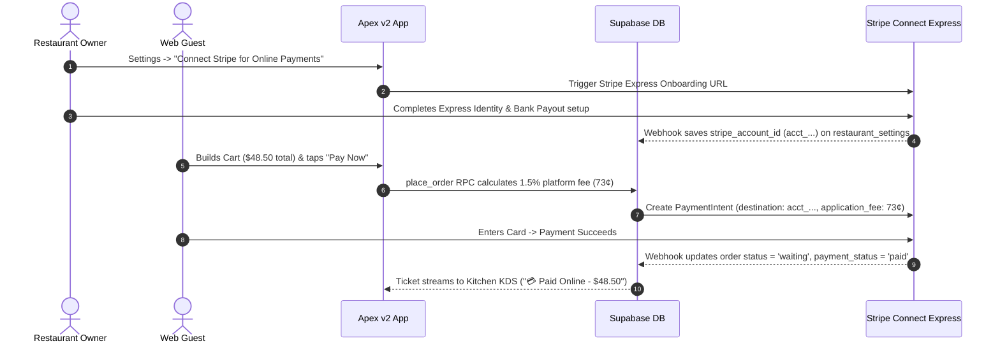

# 💳 WiSense Restaurant OS — Stripe Connect & 1.5% Platform Fee Strategy

> **Core Monetization Upgrade:** In addition to the **$99/mo Restaurant OS subscription**, WiSense captures a **1.5% platform application fee (`application_fee_amount`)** on all digital card transactions processed via Stripe Connect Express.

---

## 1. Unit Economics & LTV Impact

```
[ Traditional SaaS Only ]     ──>  $99 / mo Subscription                 = $1,188 ARR
[ SaaS + 1.5% Platform Fee ]  ──>  $99 / mo + (1.5% x $20k Order Vol)    = $399 / mo ($4,788 ARR)
```

For a typical mid-sized venue processing $20,000/month in online orders:
* **OS Subscription Fee:** $99.00 / month
* **1.5% WiSense Platform Fee:** $300.00 / month (73¢ on a $48.50 order)
* **Total Venue Value to WiSense:** **$399.00 / month ($4,788 ARR)** — a **4x increase in Customer Lifetime Value (LTV)**.

---

## 2. Competitive Positioning ("The No-Brainer Sell")

| Platform | Fixed Monthly Fee | Transaction Fee / Commission | Take on $20,000/mo Volume |
|:---|:---:|:---:|:---:|
| **DoorDash / UberEats** | $0 | **15% – 30%** commission | **$3,000 – $6,000 / mo** |
| **Toast Online Ordering** | $100+ / mo | 2.9% + 30¢ + processing fees | **$700+ / mo** |
| **WiSense Restaurant OS** | **$99 / mo** | **1.5% platform fee** + standard processing | **$399 / mo** *(Venue saves $300-$5,000/mo!)* |

**Sales Pitch:**  
> *"DoorDash steals 20% of every ticket. Toast charges $100/mo plus processing. WiSense gives you the entire operating system (scheduling, time clock, tip pool, capacity, online ordering) for $99/mo + a tiny 1.5% payment rails processing fee. You keep 98.5% of your money."*

---

## 3. System Architecture & Flow



---

## 4. Implementation Rules

1. **Pay-at-Pickup Fallback:**  
   Pay-at-pickup (cash or card at counter) remains 100% available as a fallback if a venue has not completed Stripe Connect onboarding yet.
2. **Transparent Copy:**  
   Cart checkout explicitly shows: *"Card Processing by Stripe · 1.5% OS Payment Rail Fee"*.
3. **KDS Badge:**  
   Staff Console (`StaffConsoleScreen`) displays clear visual badges: `💳 Paid Online ($48.50)` vs `💵 Pay at Pickup ($48.50)`.

---

## 📄 File Location & Sync
Saved to Obsidian Vault static reference:  
`C:\Users\nikwi\Notes\wisense\projects\APEX_V2_STRIPE_CONNECT_STRATEGY_2026-07-28.md`  
Committed and pushed to GitHub `https://github.com/nicholaswittle/wisenseobsidian.git`.

Related: [[Restaurant OS Unified Build Plan 2026-07-27]]
