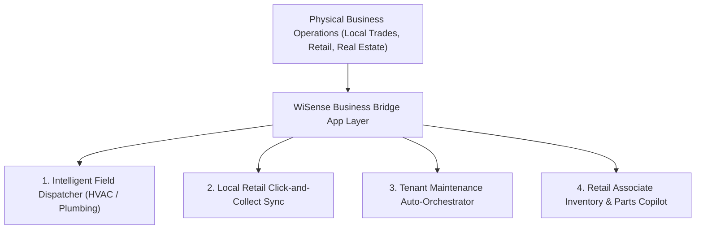

# 🌉 Business Bridge App Concepts & High-Demand Market Gaps

> **Executive Summary:** Market research analysis identifying high-demand "Business Bridge" software concepts for 2026. Shifts focus from generic AI wrappers to vertical outcome-based software bridging physical business operations with digital automation.

---

## 📊 Market Context: What People Wish Existed in 2026

1. **End of Generic AI Chat Wrappers:** Users are experiencing subscription fatigue from generic chatbots. High-ticket buyers want **software that performs multi-step workflows** (scheduling, billing, dispatching) autonomously.
2. **The "Spreadsheet-to-SaaS" Opportunity:** Massive operational friction exists in non-tech physical industries (trades, logistics, local retail, property management) running on manual text messages, sticky notes, and CSVs.
3. **Outcome-Based Pricing Models:** Transitioning from generic per-seat subscriptions to charging per *Dispatch Managed*, *Ticket Resolved*, or *Commission Avoided*.

---

## 🚀 Top 4 "Business Bridge" App Concepts for WiSense LLC

---

### Concept 1: Intelligent Field Dispatcher for Local Trades
* **Target Market:** HVAC, plumbing, electrical, roofing, landscaping companies in Perry/Cumberland/Dauphin counties.
* **The Problem:** Office dispatchers spend hours manually moving spreadsheets/whiteboards. Customers receive vague "between 8 AM and 4 PM" arrival windows.
* **The Software Bridge:** An AI dispatch board that evaluates technician location, skill certifications, job urgency, and traffic. Automatically routes the best technician, updates the schedule, and sends an Uber-style **"Your technician is on the way" SMS with live GPS tracking** to the customer.
* **Monetization:** $149/mo base + $1 per automated dispatch.

---

### Concept 2: Local Retail Omnichannel Fulfillment Hub
* **Target Market:** Independent boutique retailers, hardware stores, and local shop chains.
* **The Problem:** Physical POS systems (Square, Clover, Lightspeed) don't talk smoothly to online web stores, causing overselling or missed 1-hour local pickup sales.
* **The Software Bridge:** An AI middleware hub connecting in-store POS inventory to web ordering. When a customer orders online, the associate receives a 1-tap mobile notification on their phone/tablet with exact aisle location to pick and pack for instant curbside pickup.
* **Monetization:** $99/mo + 1% of digital pickup volume.

---

### Concept 3: Tenant-Landlord Maintenance Auto-Orchestrator
* **Target Market:** Independent landlords, property managers, and local real estate investors (10 – 100 units).
* **The Problem:** Landlords spend evenings acting as middleman phone operators between complaining tenants and unavailable contractors over leaking faucets.
* **The Software Bridge:** Tenants submit photo/video tickets via web app. AI categorizes urgency (Emergency vs Standard), matches against the landlord's pre-approved vendor list (plumber, electrician), requests job quotes, and coordinates tenant access times automatically.
* **Monetization:** $5/unit/month.

---

### Concept 4: Retail Associate Inventory & Parts Copilot
* **Target Market:** Hardware stores, auto parts, specialized industrial suppliers.
* **The Problem:** Floor associates struggle to answer complex technical questions or find matching parts across thousands of inventory SKUs.
* **The Software Bridge:** A mobile web app for staff powered by localized RAG (Retrieval-Augmented Generation). Associates type or voice-prompt technical questions (*"Which copper pipe fitting pairs with the Grundfos pump in Aisle 4?"*) and receive instant, exact answers from manufacturer manuals & live inventory.
* **Monetization:** $199/mo per store location.

---

## 🛠️ WiSense Action Plan

1. **Package Concepts into FIG Demos:** Build single-page working prototypes for **Intelligent Field Dispatch** and **Tenant Maintenance Auto-Orchestrator**.
2. **Execute Loom Outreach:** Record 90-second Loom videos targeting local trades and property managers in Central PA.

---

Related: [[business/Client Acquisition Strategy — Loom Zoom Boom & FIG Portfolio]], [[business/Marysville Diner — Web Redesign & Direct Ordering Pitch]], [[NOW]]
