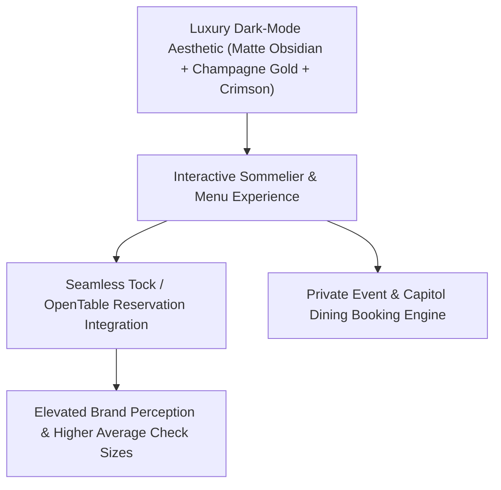

# 🍷 Cork & Fork Downtown (Harrisburg) — High-End Redesign & Digital Experience Plan

> **Target:** Cork & Fork Downtown (Harrisburg, PA)  
> **Location:** 200 State St, Harrisburg, PA 17101 · (717) 234-8429  
> **Current Site:** `corkandfork717.com/downtown/` (WordPress + Elementor Stack)  
> **Positioning:** High-End Artisanal Pizza, Small Plates & Curated Wine Bar across from the PA State Capitol.

---

## 🚨 Technical Audit of Their Current Website (`corkandfork717.com`)

1. **Heavy WordPress / Elementor Bloat:** The site loads 35+ external CSS/JS scripts (Elementor, Ele-Custom-Skin, FontAwesome, jQuery) causing 3+ second delays on mobile devices.
2. **Clunky Multi-Location Navigation:** Visitors get confused bouncing between the "Downtown" and "West Shore" location sub-pages.
3. **Flat Menu Presentation:** Menus are presented as basic text lists with zero visual hierarchy, interactive dietary filters (Gluten-Free/Vegetarian), or sommelier wine pairing notes.
4. **Under-monetized Private Dining & Catering:** Lacks a dedicated luxury Private Dining / State Capitol Event booking portal.

---

## 💎 The High-End Redesign Strategy: What WiSense Would Build

High-end establishments don't sell "$10 takeout specials" — they sell **atmosphere, craftsmanship, and luxury experiences**. The redesign must reflect a state-of-the-art, dark-mode glassmorphic wine bar aesthetic.

### 1. Visual & Aesthetic Upgrade
* **Color Palette:** Matte Charcoal (`#121212`), Deep Pinot Noir Crimson (`#5A1827`), Champagne Gold (`#D4AF37`), and Crisp Warm Cream (`#F9F6F0`).
* **Micro-Animations:** Subtle scroll-reveal text, smooth wine bottle parallax, and high-res food imagery.

### 2. Interactive Sommelier & Artisanal Menu Board
* **Interactive Filtering:** Filter menu items by *Wood-Fired Pizza*, *Handmade Pasta*, *Charcuterie*, *Gluten-Free*, and *Vegetarian*.
* **Smart Wine Pairing Suggestions:** Each dish displays a recommended wine pairing (e.g., *Chianti Classico Riserva* with Truffle Mushroom Pizza).

### 3. Private Event & Capitol VIP Dining Engine
* A high-converting VIP inquiry form for lobbyists, state politicians, corporate dinners, and cocktail receptions.

### 4. Lightning Fast (Sub-500ms) Performance
* Rebuilding from bloated WordPress/Elementor into a single-file Vanilla JS/HTML web app hosted on Vercel edge networks.

---

## 🗣️ Cold Call & Email Pitch Script for High-End Restaurants

> *"Hi [Owner/General Manager Name],*
>
> *I’m Nicholas with WiSense LLC here in Cumberland/Dauphin County. I was recently checking out Cork & Fork’s website ahead of a dinner in Downtown Harrisburg.*
>
> *Cork & Fork has incredible atmosphere and food, but your current website is running on an older, bloated WordPress setup that takes several seconds to load on mobile and doesn't match the luxury feel of your dining room.*
>
> *We specialize in high-end restaurant digital experiences — fast, dark-mode, mobile-first web apps with interactive sommelier wine pairings and seamless private event booking.*
>
> *I’d love to put together a 3-minute video preview of what an upgraded Cork & Fork site would look like. Would you be open to taking a look?"*

---

## 💰 Pricing & Commercial Structure for High-End Clients

* **Upfront Experience Build:** $1,500 – $2,500 setup (includes photography integration, sommelier menu setup, and private event engine).
* **Monthly VIP Care Plan:** $149/month (includes hosting, SSL, seasonal menu updates, wine list revisions, and priority technical support).

---

Related: [[business/Marysville Diner — Web Redesign & Direct Ordering Pitch]], [[business/WiSense Operational Partner Plan — Jigsy's]], [[NOW]]
