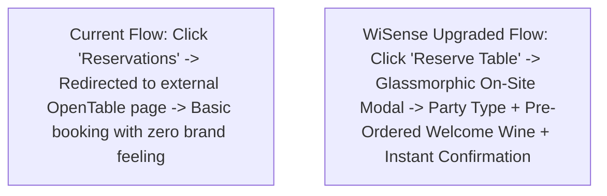

# 🍷 Cork & Fork Downtown — Reservation UX Upgrade & Cold Email Demo Plan

> **Target:** Cork & Fork Downtown (Harrisburg, PA)  
> **Location:** 200 State St, Harrisburg, PA 17101 · (717) 234-8429  
> **Current Reservation Link:** `https://www.opentable.com/booking/restref/availability?...`  
> **Core Problem:** Kicks guests OFF their website onto an external OpenTable page, destroying luxury brand immersion and missing pre-dining wine upsells.

---

## 🚨 Current OpenTable Disconnection vs. WiSense Upgraded Experience

| Current OpenTable Flow (`corkandfork717.com`) | WiSense Upgraded Demo |
| :--- | :--- |
| **External Redirection:** Kicks guests off `corkandfork717.com` onto a generic OpenTable webpage. | **Embedded Seamless Modal:** 1-tap glassmorphic reservation drawer opens directly on-site without losing brand immersion. |
| **Zero Upselling:** OpenTable offers basic party size/time pickers with no pre-dining customization. | **VIP Pre-Ordering & Add-ons:** Guests can pre-select a welcome bottle of wine (*Prosecco, Pinot Noir*) or note special occasions (*Anniversary, Capitol Business Dinner*). |
| **Under-Monetized Private Events:** No structured way for lobbyists, state house officials, or corporate parties to book 8+ guest private dining rooms. | **Dedicated Private Dining Engine:** Integrated VIP Event Inquiry portal tailored for State St / Capitol Hill receptions. |

---

## 🛠️ The 3-Step Demo Build Plan

### 1. High-End Staging Prototype
* **Directory:** `C:\development\projects\cork_and_fork_site`
* **Styling:** Dark-mode luxury wine bar (Matte Charcoal `#121212`, Pinot Noir Crimson `#5A1827`, Champagne Gold `#D4AF37`).
* **Interactive Sommelier Menu:** Dishes display recommended wine pairing tags.

### 2. Seamless On-Site Reservation Engine (`#reservation-drawer`)
* **Embedded OpenTable / Resy Widget:** Opens inside a slide-over modal directly on `corkandforksite.vercel.app`.
* **Pre-Dining VIP Add-ons:**
  - Party Type: `[ Standard Dining ]`, `[ Special Celebration ]`, `[ VIP Capitol Business Dinner ]`.
  - Welcome Wine Add-on: *"Have a chilled bottle of Prosecco ($42) waiting at our table upon arrival."*

### 3. The 90-Second Loom Audit Video
* **0:00 - 0:30:** Show `corkandfork717.com`, click "Reservations", and show how it kicks guests to OpenTable.
* **0:30 - 1:15:** Switch to `corkandforksite.vercel.app`, click `[ Reserve a Table ]`, and show the on-site drawer with the welcome wine pre-order feature.
* **1:15 - 1:30:** Friendly closing CTA.

---

## 📧 The Cold Email Pitch Script

> **Subject:** 90-second video: Upgrading Cork & Fork’s reservation experience for Capitol diners
>
> *"Hi [Owner / GM Name],*
>
> *I’m Nicholas with WiSense LLC here in Cumberland/Dauphin County. I was recently looking to book a table at Cork & Fork Downtown ahead of a dinner near the Capitol.*
>
> *Cork & Fork has incredible atmosphere, but I noticed that clicking 'Reservations' on your website kicks guests off your site onto an external OpenTable page, missing the opportunity to offer welcome wine pairings or private party bookings.*
>
> *I went ahead and built a live 90-second prototype showing how Cork & Fork could offer seamless on-site reservations with pre-ordered champagne/wine for VIP guests:*
>
> 📹 **Watch 90-Sec Loom Audit:** [Loom Video Link]  
> 🔗 **Live Demo Prototype:** [https://corkandforksite.vercel.app](https://corkandforksite.vercel.app)
>
> *No pressure at all — if you'd like to take a look under the hood, let me know!"*

---

Related: [[business/Cork & Fork Downtown — High-End Redesign Pitch Plan]], [[business/Client Acquisition Strategy — Loom Zoom Boom & FIG Portfolio]], [[NOW]]
