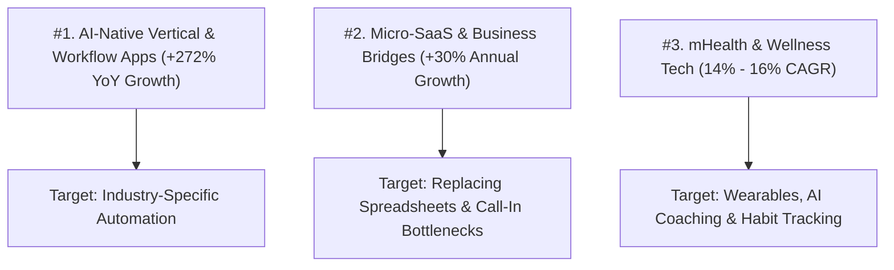

# 🚀 Fastest-Growing App Industries & Market Trends (2026)

> **Executive Summary:** Industry research identifying the fastest-growing mobile app categories, market growth rates (CAGR), monetization shifts, and strategic positioning for WiSense LLC in 2026.

---

## 📊 The Top 3 Fastest-Growing App Categories

---

## 1. 🥇 #1 AI-Native Vertical & Workflow Apps (+272% YoY Growth)
* **The Spurt:** Generative AI-integrated apps saw **1.7+ Billion downloads** and doubled their revenue every 6 months, making it the single fastest-growing category in app store history.
* **The Shift:** Simple "ChatGPT wrappers" are dying. The fastest-growing sub-segment is **Vertical AI Workflows**—apps designed for a *specific* industry (e.g., local restaurants, construction, legal, dental) that perform multi-step tasks automatically (like generating tickets, dispatching drivers, or updating inventory).
* **Key Metric:** AI-native vertical apps grow **2–3x faster** than horizontal general-purpose apps.

---

## 2. 🥈 Micro-SaaS & "Business Bridge" Apps (+30% CAGR)
* **Market Size:** The Micro-SaaS industry is expanding at a massive **30% annual growth rate** (projected to reach $59.6 Billion).
* **What's Driving It:** Small and mid-market local businesses (restaurants, HVAC, plumbers, auto-repair, boutique retail) are ditching 15-year-old desktop software and clunky phone lines for **lightweight, mobile-first web apps**.
* **Top Sub-Niches:**
  * **1-Tap Direct Ordering & Pickup Hubs** (e.g., Jigsy's, Marysville Diner, Denim Coffee).
  * **Automated Dispatch & Field Service Routing.**
  * **Single-Purpose Utility Apps** (*"One input → One magic output"* like receipt-to-tax invoice conversion).

---

## 3. 🥉 Mobile Health & Wellness Tech / mHealth (14% – 16% CAGR)
* **Market Size:** Projected to exceed **$120+ Billion**, growing steadily at ~15% annually through the early 2030s.
* **What's Driving It:** Integration with Apple Watch/Fitbit, AI-driven personal nutrition/coaching, mental health trackers, and continuous glucose monitoring.

---

## 📈 Industry Summary & Growth Comparison

| App Industry Category | Annual Growth Rate (CAGR) | Primary Revenue Model | Key Success Metric |
| :--- | :---: | :---: | :--- |
| **AI-Native Vertical Apps** | **+272% YoY** | Monthly Subscriptions ($29–$199/mo) | Workflow Automation |
| **Micro-SaaS & Business Tools** | **~30.0%** | Hybrid ($0 upfront + per-order/dispatch) | Hours Saved / Margin Kept |
| **Mobile Health (mHealth)** | **~15.2%** | B2C Subscriptions / In-App Purchases | Daily Active Retention |
| **Overall Mobile App Market** | **~14.5%** | Mixed Advertising & IAP | Download Volume |

---

## 🎯 WiSense LLC Strategic Alignment

WiSense LLC is positioned in the **exact sweet spot of current market growth**:
* Focuses on **Vertical Business Bridge Apps** for local establishments (Pizzerias, Diners, Specialty Coffee, Upscale Dining).
* This category grows **2–3x faster** than traditional software because local business owners are desperate to save labor costs and cut DoorDash/marketplace commissions.

---

Related: [[business/Business Bridge App Concepts & Market Gaps 2026]], [[business/Client Acquisition Strategy — Loom Zoom Boom & FIG Portfolio]], [[NOW]]
