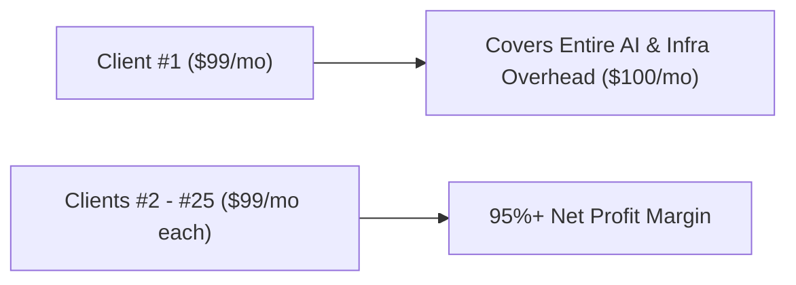

# 🚀 Restaurant Website SaaS — Master Pitch Model & Strategy (2026-07-26)

> Strategic blueprint for WiSense's productized restaurant web & online ordering platform. Grounded in market competitor analysis, unit economics, and AI-powered Service-as-a-Software delivery.

---

## 1. Executive Summary & Pitch Hook

### The Product
A turnkey, high-performance custom website with commission-free direct online ordering for local restaurants, powered by **Cloudflare Workers + D1** and **WiSense AI automation**.

### The Core Pitch Hook
> *"We build your restaurant a custom, modern website with direct online ordering — **$0 setup fee, $99/month, no long-term contracts, cancel anytime.**"*

### Why This Hook Wins
Traditional web agencies charge $1,500 – $3,000 upfront, while platforms like BentoBox or Popmenu charge $1,000+ setup fees and $179–$499/mo subscriptions. Third-party delivery apps (DoorDash, UberEats) gouge restaurants with 15%–30% commissions. 

By leading with **$0 Setup and $99/month**, WiSense removes 100% of upfront capital expenditure risk for restaurant owners while providing a massive upgrade over their existing site.

---

## 2. Offer Architecture & Pricing Tiers

To capture both skeptical mom-and-pop restaurants and established, high-volume venues, WiSense uses a 2-tiered offer model:

| Offer Tier | Upfront Setup | Monthly Rate | Target Prospect | Core Value Proposition |
| :--- | :--- | :--- | :--- | :--- |
| **Tier 1: Starter (Recommended Lead)** | **$0** | **$99 / mo** | Cash-conscious / skeptical owners | Zero risk, fast setup, no upfront barrier |
| **Tier 2: Pro Value** | **$299** | **$79 / mo** | Established spots / high volume | Lower ongoing monthly cost for high-volume spots |
| **Tier 3: Guest-Funded (Optional)** | **$0** | **$0 / mo** | Zero-budget operators | $1.50 diner convenience fee per order; $0 out-of-pocket for owner |

---

## 3. Competitive Landscape & Market Positioning

| Competitor | Setup / Onboarding Fee | Monthly Subscription | Per-Order / Fee Model | WiSense Advantage |
| :--- | :--- | :--- | :--- | :--- |
| **BentoBox** | $250 – $1,000+ | $119 – $479/mo | +$49/mo ordering + $0.99/order | WiSense is ~50% cheaper with $0 setup |
| **Popmenu** | Up to $1,300+ | $179 – $499/mo | +$50/mo ordering + $1.00 guest fee | WiSense is drastically simpler and faster |
| **ChowNow** | $119 – $499 | $119 – $328/mo | 0% commission | WiSense includes custom website build |
| **Owner.com** | Custom ($0 – $500) | $249 – $499/mo | 5% restaurant + 5% diner fee | WiSense does not take a percentage cut |
| **DoorDash Storefront**| $0 | $0 | 0% commission (Standard CC processing) | Keeps customer data; WiSense owns brand |
| **WiSense Starter** | **$0** | **$99 / mo** | **0% commission** | **Turnkey site + ordering + 95%+ profit margin** |

---

## 4. Unit Economics & AI Margin Superpower

### The Unit Economics Rule
* **WiSense Fixed Overhead**: ~$100 / month (AI Agent API usage, Cloudflare Workers, Domain hosting).
* **Client #1 Break-even**: **1 single client at $99/month (or $119/month) completely pays for the entire WiSense AI stack and operating infrastructure.**

### Scaling MRR & ARR Projections

| Active Clients | Monthly Recurring Revenue (MRR) | Annual Recurring Revenue (ARR) | Net Profit Position (After $100/mo Overhead) |
| :--- | :--- | :--- | :--- |
| **1 Client** | **$99 / mo** | **$1,188 / yr** | **Break-even (Zero out-of-pocket overhead)** |
| **5 Clients** | **$495 / mo** | **$5,940 / yr** | **+$395 / mo Net Profit** |
| **10 Clients** | **$990 / mo** | **$11,880 / yr** | **+$890 / mo Net Profit** |
| **25 Clients** | **$2,475 / mo** | **$29,700 / yr** | **+$2,375 / mo Net Profit (~$28.5k/yr)** |
| **50 Clients** | **$4,950 / mo** | **$59,400 / yr** | **+$4,850 / mo Net Profit (~$58.2k/yr)** |

### The Service-as-a-Software Advantage
Traditional web design agencies fail at low monthly prices because manual labor kills their margins. WiSense uses **AI Agents (Mythos-5.5 / Antigravity / Claude)** to digitize menus, generate brand-aligned CSS/HTML, and deploy to Cloudflare Workers in **<30 minutes**. Marginal cost per client is near $0.

---

## 5. Outreach & Sales Playbook (Enola, PA Pipeline)

WiSense has mapped **408 local business prospects** within a 5-mile radius of Enola, PA (`prospects/Enola Area Business Prospects.md` and `prospects/Restaurant.md`).

### Outreach Cadence
1. **Drop-in / Cold Visit**: Show live demo on phone ([jigsys-ordering-demo.wisense.workers.dev](https://jigsys-ordering-demo.wisense.workers.dev)).
2. **The 30-Second Elevator Pitch**:
   > *"Hi [Owner Name], we build custom websites for local restaurants with direct online ordering so you don't lose 30% to DoorDash. We do zero setup fees and just $99 a month. If you don't love it, you cancel anytime."*
3. **Leave-Behind / Digital Follow-up**: Send one-page PDF/link with preview mockup.
4. **Onboarding**: 15-minute phone call to review menu items $\rightarrow$ AI agent generates site $\rightarrow$ Live on Cloudflare in 24 hours.

---

## 6. Action Items & Next Steps

- [x] Market pricing research completed across 9 major competitors.
- [x] Settled pricing strategy: Lead with **$0 Setup / $99/mo** for cold prospects; keep **$299 Setup / $79/mo** for high-volume spots.
- [ ] Add pitch script and 1-page flyer template to `output/`.
- [ ] Begin cold outreach to top 15 restaurant targets from `prospects/Restaurant.md`.
