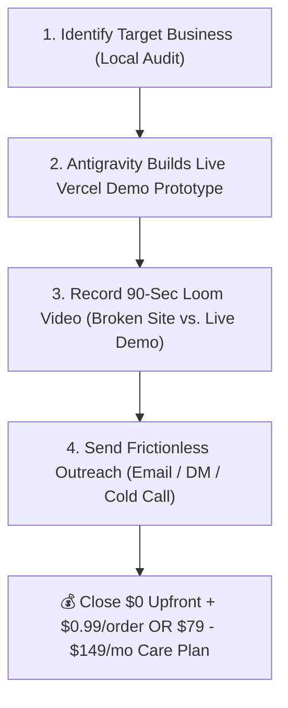

# 🚀 Client Acquisition Strategy: Loom Zoom Boom & FIG Portfolio Engine

> **Source Analysis:** Breakdown of *"The Last Video You'll Need to Get Web Design Clients"* by Chris Misterek (Self-Made Web Designer).
> **Objective:** Turn WiSense LLC's live prototype building capability into a systematic, high-converting client acquisition machine in Central PA.

---

## 📹 Video Breakdown & Core Frameworks

### 1. The Loom Zoom Boom Technique (Timestamp 8:01 / t=481s)
* **What it is:** A high-trust cold outreach method where you record a short (90 to 120-second) video walkthrough pointing out specific broken elements on a prospect's site, followed immediately by showing a live working prototype.
* **Why it works:** It destroys the "spammy web designer" perception. Instead of pitching blind, you demonstrate real value and working software *before* asking for a dime.
* **WiSense Application:** 
  - *Example (Marysville Diner):* Show their current site, click their broken `Explore Menu` button to demonstrate that it doesn't work on mobile, then switch tabs to `marysvilledinersite.vercel.app` showing the working menu board & online cart.

### 2. The FIG Portfolio Framework (Functional / Ideal Showcase)
* **What it is:** Building complete, fully-functional, high-converting live demo sites in your target niche rather than static image mockups.
* **WiSense Portfolio Assets Already Live:**
  - **Pizzeria & Brewpub Niche:** [jigsyssite.vercel.app](https://jigsyssite.vercel.app)
  - **Classic All-American Diner Niche:** [marysvilledinersite.vercel.app](https://marysvilledinersite.vercel.app)
  - **High-End Upscale Wine Bar Niche:** Cork & Fork Downtown audit & Sommelier concept.

### 3. The First 100 Framework (Warm Network Referral Engine)
* **What it is:** Compile a list of 100 personal contacts (friends, family, former coworkers, local business owners) to let them know about WiSense LLC's website care plans ($79/mo) and direct web ordering.
* **Goal:** Turn your local network into a referral engine without awkward hard-selling.

### 4. Local Leverage Strategy (20-Mile Radius Focus)
* Focus cold outreach on local establishments in Enola, Marysville, Harrisburg, Camp Hill, and Mechanicsburg where physical proximity adds instant credibility.

---

## 📝 The 5-Step Loom Zoom Boom Execution SOP for WiSense LLC

1. **Audit (10 mins):** Run `read_url_content` or manual check to find 2–3 clear friction points (broken buttons, slow mobile load, static PDF menus).
2. **Build Demo (15 mins):** Use Antigravity to generate a live, single-page prototype deployed to Vercel (`[business]site.vercel.app`).
3. **Record 90-Sec Video (2 mins):** 
   - *0:00 - 0:30:* "Hey [Name], I was looking up your hours and noticed a glitch on your mobile site (show broken button)."
   - *0:30 - 1:15:* "I went ahead and built a live prototype showing what a modern, mobile-first design with online takeout would look like (show live Vercel demo)."
   - *1:15 - 1:30:* "No pressure at all — if you'd like to check out the live link or take a look under the hood, let me know!"
4. **Deliver Message:** Send via email, Instagram DM, or contact form with the Loom link.
5. **Close Deal:** Offer the $0 upfront + $0.99 per order model or $79/mo Care Plan.

---

Related: [[business/Marysville Diner — Web Redesign & Direct Ordering Pitch]], [[business/Cork & Fork Downtown — High-End Redesign Pitch Plan]], [[business/WiSense Operational Partner Plan — Jigsy's]], [[NOW]]
