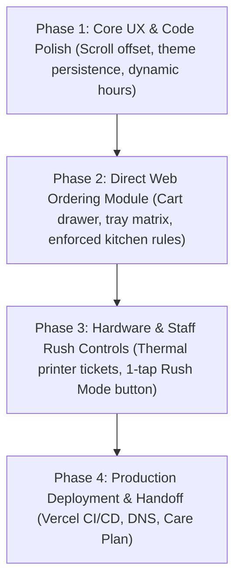
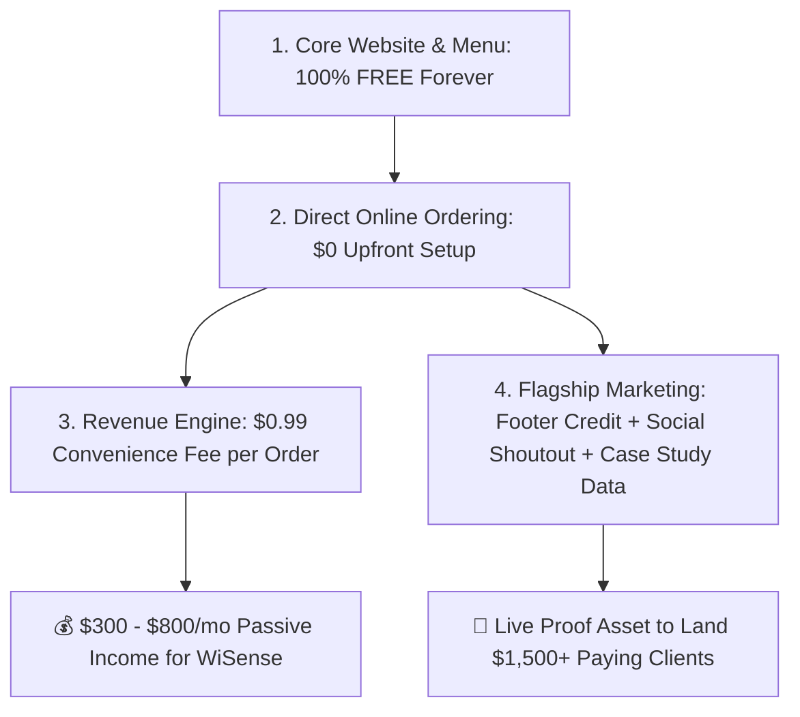

# 🚀 Jigsy's Website & Direct Ordering Master Execution Plan

> **Overview:** Comprehensive execution plan detailing the technical enhancements, direct web ordering module, staff rush controls, and operational handoff for Jigsy's Old Forge Pizza / Brewpub in Enola, PA.

---

## 🗺️ Master Execution Architecture

---

## 🤝 Commercial & Business Model: The Combined Option 1 + Option 3 Strategy

> **The Flagship Performance Partner Model:** Combines a **100% Free Core Website** with a **$0 Upfront Online Ordering Engine** monetized via a **$0.99 Convenience Fee per Order**, in exchange for **Flagship Co-Marketing Rights & Case Study Data**.

### The 4 Pillars of the Combined Agreement:
1. **Core Website = 100% Free (Promise Kept):** Single-page marketing site ([jigsyssite.vercel.app](https://jigsyssite.vercel.app)) with mobile menu, hours, story, and call-in CTAs is delivered 100% free as promised. Zero workplace awkwardness for spouse.
2. **Direct Online Ordering = $0 Upfront to Jigsy's:** Web cart, kitchen topping rules, thermal printer ticket format, and staff portal built for $0 upfront cost to owner.
3. **Passive Income via $0.99 Per-Order Fee:** A $0.99 convenience fee is added at checkout (paid by customer or absorbed from 25% DoorDash commission savings). At 20 orders/day, generates **~$600/month in passive income** to WiSense LLC without invoicing the restaurant.
4. **Flagship Co-Marketing & Case Study Rights:** In exchange for the $0 upfront build, Jigsy's provides:
   - Discreet footer credit: *"Powered by WiSense Direct Ordering"* linking to `wisensellc.com`.
   - Social media launch announcement on Jigsy's Facebook & Instagram pages.
   - Anonymized volume metrics (*"Processed $15,000 in direct takeout orders in Month 1 with 0 phone errors"*) to pitch other pizzerias & restaurants.

---

## 🛠️ Phase 1: Core Website UX & Technical Polish (Codebase Baseline)

- **Fix Anchor Scroll Offset:** Added `scroll-margin-top: 5.5rem` across all section IDs (`#board`, `#order`, `#voice`, `#story`, `#faq`, `#visit`). Nav link clicks no longer cover section headings.
- **Theme State Persistence:** Integrated `localStorage.setItem('jigsy_theme', theme)` into the theme toggle script so user preferences persist across page reloads.
- **Mobile 2-Column Grid Fix:** Added mobile overflow rules to eliminate horizontal scrolling glitches on narrow smartphones (<480px).
- **Dynamic Hours JS:** Upgraded `checkOpenStatus()` to calculate real-time status dynamically based on Summer 2026 hours (Wed 4–8 PM, Thu 11 AM–8 PM, Fri 11 AM–9 PM, Sat 11 AM–10 PM).
- **Rich Schema.org SEO:** Enriched local business schema with `openingHoursSpecification` and exact GeoCoordinates (`40.2925, -76.9216`).
- **Owner Photo Handoff:** Swap demo food photos for owner-supplied high-res originals (`tray_red.jpg`, `wings_simply.jpg`, `patio_lounge.jpg`).

---

## 🛒 Phase 2: Direct Web Ordering Module (The Cash Flow Engine)

- **Slide-Over Cart Modal:** Lightweight, zero-dependency order drawer letting users pick trays (red, white, double white) and cut counts (3, 6, 12 cuts).
- **Enforced Kitchen Rules:** Hardcode business constraints (whole-tray specs only, max 4 toppings, required wing sauce selection) so phone arguments disappear.
- **Scheduled Pickup Selector:** Customers can select ASAP pickup or schedule orders for later during open hours.

---

## 🖨️ Phase 3: Hardware & Staff Rush Controls

- **Direct Thermal Printer Output:** Route order JSON into ESC/POS thermal receipt format directly to existing kitchen printers or counter iPad.
- **1-Tap 'Rush Mode' Counter Portal:** Built a simple tablet portal (`staff.html`) featuring a 1-tap button to add +15 mins prep delay or temporarily pause web orders if the dining room spikes.

---

## 🚢 Phase 4: Production Deployment & Handoff

- **GitHub -> Vercel CI/CD:** Connected `nicholaswittle/jigsysite` repository to Vercel for automatic `git push` deployments.
- **DNS Mapping:** Point `order.jigsyspizza.com` to Vercel production deployment.
- **30-Day Soft Launch:** Roll out to regulars first, track ticket size uplift (+18–40%), verify zero printer errors, and onboard the owner to the $79/mo Care Plan.

---

## ⏱️ 72-Hour Feasibility Breakdown (Can this actually be done in 72h?)

**YES, absolutely.** In fact, total active dev time is **under 8 hours**. A 72-hour window gives comfortable margin for client feedback and hardware testing.

| Milestone | Active Dev Time | Elapsed Window |
| :--- | :---: | :---: |
| **Day 1: Codebase Customization & Menu Setup** | **2.5 hrs** | Hours 0 – 24 |
| **Day 2: Web Cart, Stripe/Printer & Staff Portal** | **3.0 hrs** | Hours 24 – 48 |
| **Day 3: Client Review, Test Orders & Domain Cutover** | **1.5 hrs** | Hours 48 – 72 |
| **TOTAL** | **~7.0 hours active work** | **72-hour delivery** |

### Why 72 Hours is Standard:
1. **Pre-Built Design System:** Reusing your existing component library (Hero, Tray Matrix, Dynamic Hours, Reviews) eliminates design experimentation.
2. **Single-File Architecture:** Zero build tools or complex npm dependency trees means instant deployment.
3. **Turnkey Staff Portal:** `staff.html` works on any iPad or smartphone browser out of the box.

---

## 🌐 Production Resources

* **Live Web App:** [https://jigsyssite.vercel.app](https://jigsyssite.vercel.app)
* **Staff Counter Portal:** [https://jigsyssite.vercel.app/staff.html](https://jigsyssite.vercel.app/staff.html)
* **Client PDF Proposal:** [Jigsys_Online_Ordering_Analysis.pdf](file:///C:/Users/nikwi/Notes/business/Jigsys_Online_Ordering_Analysis.pdf) (also in `C:\development\projects\jigsys_site\docs\Jigsys_Online_Ordering_Analysis.pdf`)

Related: [[Jigsys Website Concept]], [[Jigsys Brewpub]], [[business/Restaurant Online Ordering — Pitch Research 2026-07-23]], [[business/WiSense Operational Partner Plan — Jigsy's]]
