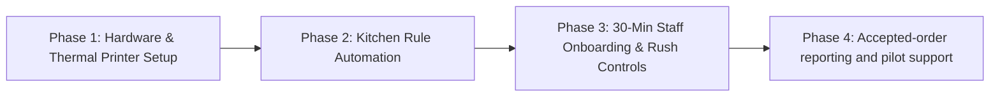

# 🛠️ WiSense Forward-Deployed Operational Partner Plan: Jigsy's Brewpub

> **Objective:** Test whether an owned pickup-ordering channel can reduce phone
> interruptions while protecting kitchen throughput and preserving Jigsy's
> existing pay-at-the-counter workflow.

## Current scope correction — 2026-07-23

- The owner liked the website and the online-ordering idea has been planted, but
  no pilot has been approved.
- The isolated ordering demo is live at
  https://jigsys-ordering-demo.vercel.app.
- Jigsy-specific pricing is **free core + $0.99 per accepted online order**.
- Jigsy's collects all money in person; WiSense does not use Stripe or process
  customer payments.
- The `$79/month` care plan and large retained-profit figures below are not the
  current Jigsy offer and must not be presented as agreed terms.
- The demo is not cross-device yet. Production needs a database, staff login,
  notifications, and printer testing.

Canonical build/status record:
[[business/Jigsys Ordering Demo — Build Record 2026-07-23]].

---

## 🎯 How WiSense Fits In: The Forward-Deployed Partner Model

Traditional web agencies deliver a site and walk away. WiSense acts as a **Forward-Deployed Digital Operations Partner**, taking full responsibility for the hardware integration, kitchen rule automation, staff training, and ongoing technical maintenance.

---

## 🤝 Commercial Structure: Jigsy-specific free + per-order model

To protect family harmony at your spouse's workplace while creating a sustainable revenue stream for WiSense:

1. **Free Core Website (100% Free):** Marketing site, menu, hours, and branding delivered free as agreed.
2. **Direct Web Ordering ($0 Upfront Setup):** Web cart, thermal printer tickets, and staff portal installed at $0 out-of-pocket to the owner.
3. **$0.99 Per Accepted Order:** Added as a disclosed online-ordering fee on
   the ticket. Jigsy's collects it at pickup and settles accepted-order fees
   with WiSense separately each month.
4. **Future case study only with permission:** Any footer credit, social post,
   or anonymized performance data requires explicit owner approval after a
   successful pilot.

---

## 📋 The 4-Phase Operational Execution Plan

### Phase 1: Zero-Disruption Hardware & Ticket Printing
* **Pilot ticket output:** The demo opens a receipt-sized browser print dialog.
  Direct or silent printing is a later option after identifying and testing the
  actual kitchen/bar printer.
* **Line-Cook Ready Layout:** Tickets follow Jigsy's exact kitchen format (Tray style, Cut count, Crust type, Wing sauce level, Pickup time). Line cooks read tickets without any change to their cooking flow.

### Phase 2: Automated Kitchen Rule Enforcement
* **No More Phone Arguments:** We hardcode Jigsy's exact kitchen constraints into the web app:
  * Whole-tray Old Forge specs (no half-and-half topping splits if forbidden by kitchen rules).
  * Mandatory wing sauce radio buttons.
  * Automatic max topping limits per tray.
* **Staff-controlled prep time:** Staff sets the current estimate shown before
  the customer submits a pickup request.

### Phase 3: Staff Training & 1-Tap "Rush Mode" Controls
* **30-Minute Staff Onboarding:** Front-of-house staff learn how to manage the simple counter tablet.
* **1-Tap 'Rush Mode' Snooze:** If the dining room or patio spikes unexpectedly, staff can tap a single button on the counter tablet to add +15 minutes to takeout prep times or temporarily pause web orders for 30 minutes.
* **Frees Up Servers:** Taking order intake off the phone lines lets servers focus 100% on high-margin dine-in customers, patio drinks, and lounge hospitality.

### Phase 4: Accepted-order reporting and support
* **Monthly statement:** Accepted online orders × $0.99, paid separately by
  check, cash, or bank transfer.
* **Operational support:** Hosting, menu updates, printer troubleshooting, and
  performance review only after owner approval and a real pilot agreement.

---

## 📊 Audited Friction Points & Digital Solutions Matrix

| Real Operational Friction | Root Cause | WiSense Digital Solution |
| :--- | :--- | :--- |
| **Phone Rush Bottleneck** | Single phone line during Friday/Saturday dinner rush creates busy signals. | **24/7 Unlimited Cart:** Handles infinite concurrent orders without phone lines. |
| **Image-Only Mobile Menu** | Static JPG/PDF menus are hard to read and zoom on mobile screens. | **Interactive Tray Matrix:** Searchable, responsive Old Forge tray selector with live pricing & photos. |
| **Order Rule Friction** | Phone miscommunication over topping splits, wing heat, or special requests. | **Enforced Digital Modifiers:** Hardcodes whole-tray specs & topping limits into checkout. |
| **Off-Hours Revenue Loss** | Closed Mon–Tue; open late afternoon Wed with zero order intake. | **Scheduled Pickup Capture:** Diners schedule pickup orders hours or days ahead of time. |
| **Staff Multi-Tasking Overload** | Waitstaff interrupted by ringing phones while serving dining room tables. | **Direct Thermal Ticket Printing:** Orders flow directly to the kitchen, freeing waitstaff. |

---

## 🗣️ The Client Pitch Script for Nicholas

> *"Mr. [Owner Name], Jigsy's has the best Old Forge pizza and wings in Enola, but right now every single takeout order has to pass through a ringing phone line. On Friday nights, your staff are juggling running beers to tables while answering calls, and callers get busy signals.*
>
> *We don't just build websites — we act as your digital operations partner. We set up an owned web ordering site that prints tickets directly into your kitchen, enforces your exact topping rules automatically, and gives your staff a 1-tap 'Rush Mode' button if the dining room gets slammed.*
>
> *There is no upfront website or ordering setup charge for Jigsy's. Customers
> still pay you at the counter. A clearly shown 99-cent online-ordering fee
> applies only when you accept the request, and you can pause online ordering
> whenever the kitchen gets busy. The next step would only be a small,
> reversible pilot after we confirm your printer and staff setup."*

---

Related: [[business/Restaurant Online Ordering — Pitch Research 2026-07-23]], [[Jigsys Website Concept]], [[Jigsys Brewpub]], [[business/Web Redesign — Recurring Model Proposal 2026-07-23]]
