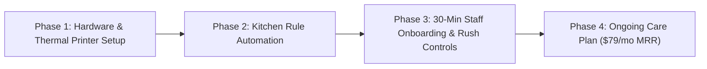

# 🛠️ WiSense Forward-Deployed Operational Partner Plan: Jigsy's Brewpub

> **Objective:** Transition Jigsy's Old Forge Pizza from a 100% phone-only takeout model to an owned, high-converting digital web ordering channel while protecting kitchen throughput, simplifying staff operations, and adding ~$70K/year in retained gross profit.

---

## 🎯 How WiSense Fits In: The Forward-Deployed Partner Model

Traditional web agencies deliver a site and walk away. WiSense acts as a **Forward-Deployed Digital Operations Partner**, taking full responsibility for the hardware integration, kitchen rule automation, staff training, and ongoing technical maintenance.

---

## 🤝 Commercial Structure: Option 1 + Option 3 Combined Model

To protect family harmony at your spouse's workplace while creating a sustainable revenue stream for WiSense:

1. **Free Core Website (100% Free):** Marketing site, menu, hours, and branding delivered free as agreed.
2. **Direct Web Ordering ($0 Upfront Setup):** Web cart, thermal printer tickets, and staff portal installed at $0 out-of-pocket to the owner.
3. **$0.99 Per-Order Convenience Fee:** Added at checkout (paid by customer or absorbed from DoorDash commission savings), generating **~$600/month in passive income** to WiSense LLC.
4. **Flagship Marketing Rights:** Footer credit, social media post, and anonymized performance data used to land other paying restaurant clients ($1,500 + $149/mo).

---

## 📋 The 4-Phase Operational Execution Plan

### Phase 1: Zero-Disruption Hardware & Ticket Printing
* **Direct Thermal Printer Output:** WiSense configures web orders to print directly to your existing kitchen/bar thermal receipt printer (or an optional dedicated counter tablet).
* **Line-Cook Ready Layout:** Tickets follow Jigsy's exact kitchen format (Tray style, Cut count, Crust type, Wing sauce level, Pickup time). Line cooks read tickets without any change to their cooking flow.

### Phase 2: Automated Kitchen Rule Enforcement
* **No More Phone Arguments:** We hardcode Jigsy's exact kitchen constraints into the web app:
  * Whole-tray Old Forge specs (no half-and-half topping splits if forbidden by kitchen rules).
  * Mandatory wing sauce radio buttons.
  * Automatic max topping limits per tray.
* **Smart Prep Time Scaling:** Automatically adjusts estimated pickup times (e.g., 20 mins during off-peak vs 45 mins during Friday 6 PM rush) so expectations are set before the customer pays.

### Phase 3: Staff Training & 1-Tap "Rush Mode" Controls
* **30-Minute Staff Onboarding:** Front-of-house staff learn how to manage the simple counter tablet.
* **1-Tap 'Rush Mode' Snooze:** If the dining room or patio spikes unexpectedly, staff can tap a single button on the counter tablet to add +15 minutes to takeout prep times or temporarily pause web orders for 30 minutes.
* **Frees Up Servers:** Taking order intake off the phone lines lets servers focus 100% on high-margin dine-in customers, patio drinks, and lounge hospitality.

### Phase 4: Done-For-You Care Plan ($79/month)
* **Full Technical Management:** WiSense handles web hosting, SSL security, domain setup, seasonal menu updates, and price changes.
* **Performance Reviews:** Monthly reports on ticket size uplift, peak order volume, and avoided marketplace commissions.

---

## 📊 Audited Friction Points & Digital Solutions Matrix

| Real Operational Friction | Root Cause | WiSense Digital Solution |
| :--- | :--- | :--- |
| **Phone Rush Bottleneck** | Single phone line during Friday/Saturday dinner rush creates busy signals. | **24/7 Unlimited Cart:** Handles infinite concurrent orders without phone lines. |
| **Image-Only Mobile Menu** | Static JPG/PDF menus are hard to read and zoom on mobile screens. | **Interactive Tray Matrix:** Searchable, responsive Old Forge tray selector with live pricing & photos. |
| **Order Rule Friction** | Phone miscommunication over topping splits, wing heat, or special requests. | **Enforced Digital Modifiers:** Hardcodes whole-tray specs & topping limits into checkout. |
| **Off-Hours Revenue Loss** | Closed Mon–Tue; open late afternoon Wed with zero order intake. | **Scheduled Pickup Capture:** Diners schedule pickup orders hours or days ahead of time. |
| **Staff Multi-Tasking Overload** | Waitstaff interrupted by ringing phones while serving dining room tables. | **Direct Thermal Ticket Printing:** Orders flow directly to the kitchen, freeing waitstaff. |

---

## 🗣️ The Client Pitch Script for Nicholas

> *"Mr. [Owner Name], Jigsy's has the best Old Forge pizza and wings in Enola, but right now every single takeout order has to pass through a ringing phone line. On Friday nights, your staff are juggling running beers to tables while answering calls, and callers get busy signals.*
>
> *We don't just build websites — we act as your digital operations partner. We set up an owned web ordering site that prints tickets directly into your kitchen, enforces your exact topping rules automatically, and gives your staff a 1-tap 'Rush Mode' button if the dining room gets slammed.*
>
> *Best of all, keeping orders on your own site instead of renting DoorDash keeps an extra **~$10 per order in your pocket** — that's over **$70,000 a year** in profit you keep."*

---

Related: [[business/Restaurant Online Ordering — Pitch Research 2026-07-23]], [[Jigsys Website Concept]], [[Jigsys Brewpub]], [[business/Web Redesign — Recurring Model Proposal 2026-07-23]]
