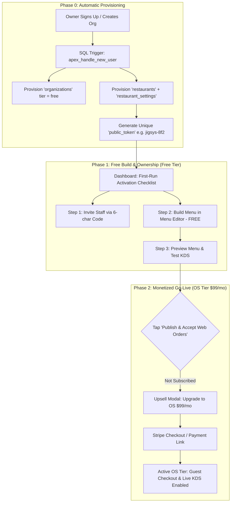

# 🚀 Apex v2 — Self-Serve OS Game Plan (Hands-Off Growth)

> **Objective:** Design a hands-off, self-serve activation and monetization funnel for Apex v2 where venue owners download the app, activate on the free floor-ops wedge (scheduling/clock-in), build their menu for free, and upgrade to paid tiers ($25/mo Pro, $99/mo OS) to publish web ordering—all without requiring founder concierge ops.
>
> **App Path:** `C:\development\projects\apex_v2` · Live: [https://apex-v2-ten.vercel.app](https://apex-v2-ten.vercel.app)  
> **Backend:** Supabase Project `pqkremkwfkudrhtxasdj`

---

## 1. Rebuttal & Synthesis: Why Cursor's 4 Adjustments Complete Option C

Cursor's critique is **100% correct and sharpens the Product-Led Growth (PLG) engine**. Here is the explicit breakdown of why these 4 adjustments make Option C bulletproof:

### A. The "Build Free, Pay OS to Publish" Model (PLG Masterclass)
* **The Problem:** Gating the Menu Editor behind $99/mo OS creates a catch-22. An owner will not pay $99 for an ordering system before seeing what their menu looks like in the app.
* **The Solution:**  
  * **Free/Pro Tier:** Owners can create categories, add items, set prices, and preview their menu for **FREE**. They invest 15 minutes of labor into Apex. They now feel complete ownership.
  * **OS Tier ($99/mo):** Unlocks **Go-Live Publishing** (`public_token` guest order link active, live kitchen KDS `StaffConsoleScreen`, and capacity engine).
  * **The Conversion Hook:** When the owner taps *"Publish Menu & Open Web Ordering"*, Apex displays: *"Your 18-item menu is ready! Upgrade to Restaurant OS ($99/mo) to accept live web orders."*

### B. Code Alignment with `entitlements.dart`
* Align marketing copy strictly with `entitlements.dart`:
  * **Free ($0):** Scheduling, Shift Swaps, Time Clock, Push Notifications.
  * **Pro ($25/mo):** Manager Log Book, Tip Management, Labor Cost, Offline Mode, Team Chat.
  * **OS ($99/mo):** Online Ordering (Publish & KDS), Smart Capacity, No-Show Engine, Labor vs Revenue Analytics.

### C. Razor-Focused Sprint vs. Audit Hygiene
* **Rule:** Do not mix security/database audit hygiene (Shifts FK, Tip RLS, Flood Limits) with the 2-Week Self-Serve Build.
* Hygiene tickets are parked into a separate patch release. The 2-week sprint is 100% laser-focused on: **Bootstrap → Menu Editor → Checklist → Copy Link → Support Mailto**.

### D. Corrected File & Route Basenames
* **86 Board:** `menu_stock_screen.dart` (mid-shift out-of-stock toggles).
* **Menu Editor:** `menu_editor_screen.dart` (CRUD category/item management).
* **Guest Ordering Route:** Uses existing `publicToken` route on `MenuScreen` (`#/order?token=jigsys`).

---

## 2. Recommended Architecture & Flow Map



---

## 3. Detailed Self-Serve Mechanics

### A. The Website "Door" Strategy (No Agency Work)
* **Core Rule:** **Never build custom marketing websites per venue.** Building `jigsys_site` was a high-value move for the flagship pilot case study, but doing it for every customer turns WiSense into a slow web agency.
* **The OS Hosted Guest URL:** Every venue automatically gets a hosted guest menu at:  
  `https://apex-v2-ten.vercel.app/?token=PUBLIC_TOKEN`
* **How Venues Connect Their Existing Site / Socials:**  
  The venue's website (Squarespace, Wix, WordPress) or social media (Instagram, Facebook, Google Business Profile) is simply a **door** pointing at their Apex guest URL.  
  1. Venue copies their guest link or HTML button snippet: `<a href="https://apex-v2-ten.vercel.app/?token=XYZ">Order Pickup</a>`.
  2. Venue pastes the link into their Google Business / Instagram profile or existing site.
  3. **The OS owns menu, checkout, KDS, and smart capacity.** Their site is just a door.

---

### B. Venue Auto-Bootstrap (Phase 0)
Whenever an organization is created (via `apex_create_organization` RPC or self-service signup), a Postgres trigger automatically provisions:
1. `organizations` row (`tier = 'free'`).
2. `restaurants` row (`id = gen_random_uuid()`, `organization_id`, `name = org_name`, `public_token = slugify(org_name) + '-' + random_hex(4)`).
3. `restaurant_settings` row (`auto_pause_enabled = true`, `auto_pause_threshold = 1`, `max_orders_per_hour = 15`, `prep_minutes = 20`, `tax_rate = 0.06`).

---

### B. First-Run Activation Checklist
Upon signing in as an Owner or Manager, if `profiles` count == 1 or `menu_items` count == 0, `EmployeeDashboard` displays a prominent **"Get Venue Ready" Checklist**:

* [ ] **Invite your crew** *(Tap to copy 6-character staff invite code)*
* [ ] **Build your menu** *(Add categories & items for free in Menu Editor)*
* [ ] **Preview guest menu** *(See your menu in guest view)*
* [ ] **Publish & accept web orders** *(Unlock $99/mo OS tier to go live)*

---

### C. Menu Editor Scope (`menu_editor_screen.dart`)
Accessible from settings to all tiers (Free, Pro, OS):

* **Categories Management:**
  * Add / Rename / Reorder / Delete Category (e.g., *Trays, Wings, Drinks*).
* **Menu Item Management:**
  * Item Name (text)
  * Description (text, optional)
  * Price in Dollars (UI field `$18.50` auto-converts to `price_cents = 1850`)
  * Available toggle (86 switch)
  * Category selector
* **Publish Gate:**
  * Free/Pro users can build and view full menu in preview mode. Tapping *"Enable Guest Checkout"* prompts the OS $99/mo upgrade.

---

### D. Hands-Off Support Model

**Principle:** Nik never manually edits SQL or configures venue settings. The app provides structured diagnostic email triggers.

1. **In-App "Need Help?" Triggers:**
   * Located in App Drawer and Error Screens: `"Need help? Email Nik"`
2. **Pre-Filled Diagnostic Payload:**
   * Tapping the button opens `mailto:nik@wisensellc.com` with pre-populated payload:
     ```text
     Subject: Apex Support Request - Jigsy's Brewpub (org: c82c025d-73...)
     Body:
     -- Diagnostic Info (do not edit) --
     User ID: 8f2a10...
     Org ID: c82c025d-7300-4d41-a84d-bc17d3c3104f
     Tier: free
     App Version: 2.1.0 (Web)
     Issue Description: [ Type here ]
     ```

---

## 4. Explicit Non-Goals for 2-Week Sprint

* ❌ **No Audit Hygiene Tickets in Funnel Sprint:** Shifts FK, Tip RLS, Flood Limits, and Labor Filters are moved to a separate patch.
* ❌ **No AI PDF Menu Parser / Camera Scanner:** Manual CRUD form is 100% reliable and ships in 3 days.
* ❌ **No Custom DNS Subdomains:** Web ordering uses existing route (`#/order?token=public_token`).
* ❌ **No Native POS Hardware Hardware Plugins:** Manual sales entry via `daily_revenue` screen.

---

## 5. Open Decisions for Nik

1. **Stripe Billing Integration:** Use Stripe Payment Link attached to the in-app Upgrade button, or Stripe Customer Portal? *(Recommendation: Direct Stripe Payment Link for v1).*
2. **Support Email Address:** Standardize on `nik@wisensellc.com` for direct founder responsiveness.
3. **Trial Strategy:** Offer a 14-day free OS trial on credit card, or strict $0 build + $99 pay-to-publish? *(Recommendation: Strict Build Free + $99 Pay-to-Publish eliminates trial abuse).*

---

## ⚡ First 2 Weeks — Exact Build Order (Razor-Sharp Execution)

### Week 1: Auto-Provisioning & Menu Editor (Backend & Core CRUD)
- [ ] **Task 1.1:** Update SQL migration `apex_create_organization` to automatically insert `restaurants` and `restaurant_settings` rows with a slugified `public_token` whenever an org is created.
- [ ] **Task 1.2:** Build `MenuEditorScreen` in `lib/features/ordering/menu_editor_screen.dart` (Add/Edit Category, Add/Edit Item Name, Description, Price, Category dropdown).
- [ ] **Task 1.3:** Wire `MenuEditorScreen` to read/write `menu_categories` and `menu_items` tables via Supabase client.

### Week 2: Activation Checklist, Publish Gate & Support (Funnel Completion)
- [ ] **Task 2.1:** Build `FirstRunChecklistCard` widget on `EmployeeDashboard` (Invite Crew, Build Menu, Preview Menu, Publish OS).
- [ ] **Task 2.2:** Implement OS Tier Publish Gate on `MenuScreen` / Guest Checkout (If `!entitlements.has(OsModule.onlineOrdering)`, show *"Preview Mode · Upgrade to OS ($99/mo) to accept live orders"*).
- [ ] **Task 2.3:** Add "Copy Guest Order Link" button (`#/order?token=public_token`) with toast notification to `StaffConsoleScreen` and `AdminConsoleScreen`.
- [ ] **Task 2.4:** Wire in-app `SupportDialog` with pre-filled diagnostic `mailto:nik@wisensellc.com` payload across app drawer and error screens.

---

## 📄 File Location & Sync
Saved to Obsidian Vault static reference:  
`C:\Users\nikwi\Notes\wisense\projects\APEX_V2_SELF_SERVE_OS_GAMEPLAN_2026-07-28.md`  
Committed and pushed to GitHub `https://github.com/nicholaswittle/wisenseobsidian.git`.

Related: [[projects/Apex v2 — Restaurant OS Build]] · [[projects/APEX_SELF_SERVE_PLAN_REVISIONS_2026-08-01]] · [[projects/APEX_V2_TEMPLATE_TO_PRODUCT_GAP_MAP_2026-07-31]]
