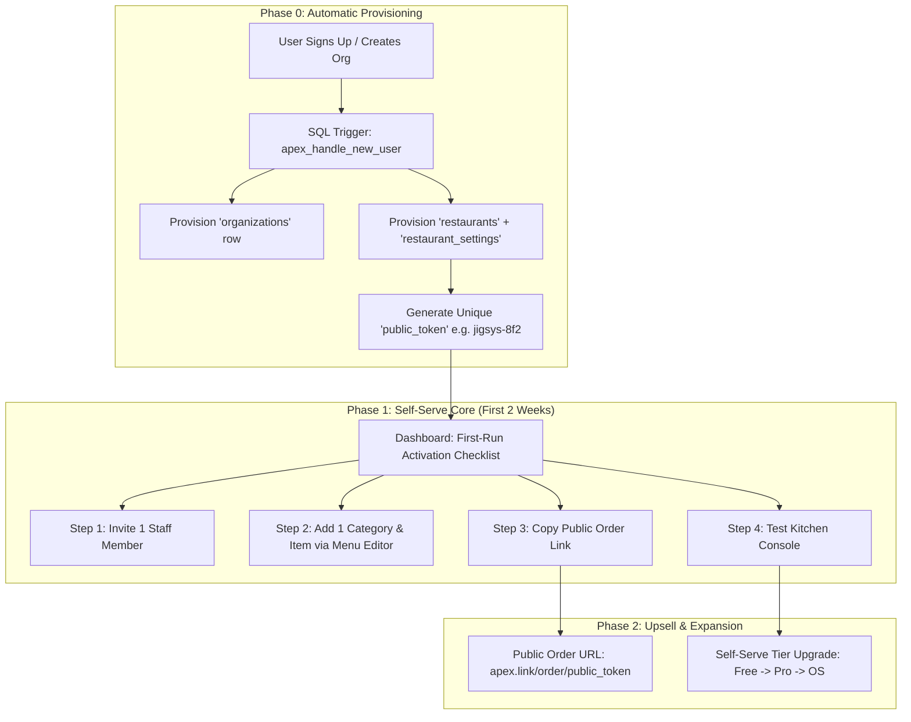

# 🚀 Apex v2 — Self-Serve OS Game Plan (Hands-Off Growth)

> **Objective:** Design a hands-off, self-serve activation and monetization funnel for Apex v2 where venue owners download the app, activate on the free floor-ops wedge, set up their own online ordering menu in under 20 minutes, and upgrade to paid tiers ($25/mo Pro, $99/mo OS) without requiring founder concierge ops.
>
> **App Path:** `C:\development\projects\apex_v2` · Live: [https://apex-v2-ten.vercel.app](https://apex-v2-ten.vercel.app)  
> **Backend:** Supabase Project `pqkremkwfkudrhtxasdj`

---

## 1. Context Analysis

### Why Self-Serve Setup is the App Store & Monetization Bottleneck

Apex v2 currently possesses an exceptionally high-value product core (drag-and-drop scheduling, offline QR time clock, tip pool auditing, kitchen capacity auto-pausing, no-show call-outs, and server-priced online ordering). However, **it cannot scale or convert autonomously today due to three critical friction bottlenecks**:

1. **Incomplete Venue Provisioning (`admin_create_org` / Signup Gap):**  
   When a new owner signs up or creates an organization, Supabase creates an `organizations` row, but **does not provision a corresponding `restaurants` row, `restaurant_settings`, or `public_token`**. Without a `restaurants` record, the ordering console, capacity engine, and guest checkout crash or display empty error states. Currently, venue creation requires manual SQL inserts by Nik.

2. **No In-App Menu Editor (Categories, Items, Prices):**  
   Menu categories, items, and pricing are currently SQL-seeded in Supabase (e.g., Jigsy’s 52-item menu migration). The only in-app menu tool is the "86 Board", which toggles `available = true/false`. An owner who unlocks the $99/mo OS tier cannot load their own menu without emailing Nik a PDF and waiting for a manual database seed. **A paid feature that requires founder intervention to configure is unconvertible in self-serve software.**

3. **High Initial Setup Anxiety & Unguided First-Run:**  
   When a new manager signs in, they land on a dark, empty dashboard. Without an interactive **First-Run Activation Checklist**, owners do not know the 4 steps to value: *Add 1 Staff Member → Create 1 Menu Category → Copy Public Order Link → Test Clock-In*.

---

## 2. Strategic Options

### Option A: Concierge Onboarding (Status Quo)
* **Description:** Nik manually seeds menus, provisions `restaurants` rows, and configures `public_token` via SQL for every new lead.
* **Trade-offs:** 
  * 🔴 *Ops Load:* Unscalable for a solo founder (max 5–10 venues before burnout).
  * 🔴 *Conversion:* Multi-day onboarding delay kills impulse buy momentum.
  * 🟢 *Polish:* Flawless menu data for the first 3 pilot venues.

### Option B: AI Menu Scanner & White-Label Domain Builder (Over-Engineered)
* **Description:** Build an OCR AI scanner that parses PDF/photo menus, auto-generates modifier groups, and spins up custom DNS subdomains.
* **Trade-offs:** 
  * 🔴 *Development Time:* 6–8 weeks of complex AI parsing and regex debugging.
  * 🔴 *Reliability:* Modifiers and price parsing errors create silent financial bugs.
  * 🟢 *Marketing Hype:* Impressive demo video.

### Option C (RECOMMENDED): Guided In-App Self-Serve Lifecycle (Minimalist CRUD + Auto-Provisioning)
* **Description:** Automatic DB triggers provision `restaurants` + `public_token` on org creation; ship a clean 2-screen Menu Editor (Categories + Items + Prices); add an interactive First-Run Activation Checklist; provide in-app "Email Nik" diagnostic support.
* **Trade-offs:**
  * 🟢 *Speed:* Executable in 2 weeks of focused Flutter + SQL development.
  * 🟢 *Ops Load:* Near ZERO founder ops; user feels 100% in control of their venue.
  * 🟢 *Conversion:* Immediate same-day gratification (Sign up at 2 PM → Take first test web order at 2:20 PM).

---

## 3. Recommended Path: Phased Roadmap



---

### A. Venue Auto-Bootstrap (Phase 0)
Whenever an organization is created (via `apex_create_organization` RPC or self-service signup), a Postgres trigger automatically provisions:
1. `organizations` row (`tier = 'free'`).
2. `restaurants` row (`id = gen_random_uuid()`, `organization_id`, `name = org_name`, `public_token = slugify(org_name) + '-' + random_hex(4)`).
3. `restaurant_settings` row (`auto_pause_enabled = true`, `auto_pause_threshold = 1`, `max_orders_per_hour = 15`, `prep_minutes = 20`, `tax_rate = 0.06`).

**Result:** Every venue gets an immediate, functional `public_token` and ordering backend at the exact moment of account creation.

---

### B. First-Run Activation Checklist (Phase 1)
Upon signing in as an Owner or Manager, if `menu_items` count == 0 or `profiles` count == 1, `EmployeeDashboard` displays a prominent **"Get Venue Ready" Checklist**:

* [ ] **Invite your crew** *(Tap to generate 6-character invite code for staff)*
* [ ] **Add your first menu item** *(Opens Menu Editor → add 1 item in 60s)*
* [ ] **Copy your guest order link** *(Copies `apex.link/order/jigsys-8f2` or test URL)*
* [ ] **Test your kitchen console** *(Places dummy test order to verify KDS chime)*

---

### C. Menu Editor v1 Scope (Minimalist & Bulletproof)
Located in `StaffConsoleScreen` / Settings under a new tab **"Edit Menu"**:

* **Categories Management:**
  * Add / Rename / Reorder / Delete Category (e.g., *Pizzas, Wings, Drinks*).
* **Menu Item Management:**
  * Name (text)
  * Description (text, optional)
  * Price in Dollars (formatted UI `$18.50` stored as `price_cents = 1850`)
  * Available toggle (86 switch)
  * Category dropdown
* **Deferred to v1.5 / Phase 2:**
  * Complex nested modifier groups (Crust options, sauce selections). Simple item notes field handles custom requests in v1.

---

### D. Where 86 Board & Staff Console Fit
* **Staff Console (`StaffConsoleScreen`):** Remains the live kitchen display (KDS) for incoming orders (`waiting` → `accepted` → `completed`).
* **86 Board (`menu_screen.dart`):** Remains the fast, high-contrast toggle screen used mid-shift by line cooks to mark items out-of-stock without opening full item editing settings.

---

### E. Freemium vs. Paid Gates (The Self-Selling Funnel)

| Tier | Price | Included Features (The Hook) | Upsell Cue in App |
|:---|:---:|:---|:---|
| **Free** | **$0** | Scheduling, Drag & Drop, Time Clock, QR Punch, Shift Swaps, Team Chat | Owner sees *"Track Tip Allocations & Manager Log Book"* → Banner prompts Pro ($25). |
| **Pro** | **$25/mo** | All Free + Manager Log Book, Tip Pool Calculator, Server Tip Audit, Labor Cost % | Owner sees *"Unlock Online Ordering & Smart Capacity"* → Banner prompts OS ($99). |
| **OS** | **$99/mo** | All Pro + Menu Editor, Web Ordering, Kitchen Capacity Auto-Pause, Call-Out Engine | Owner gets full venue operating system. |

---

### F. Hands-Off Support Model

**Principle:** Nik never manually edits SQL or configures venue settings. The app provides structured diagnostic email triggers.

1. **In-App "Need Help?" Triggers:**
   * Located in App Drawer and Error Screens: `"Need help setting up? Email Nik"`
2. **Pre-Filled Diagnostic Payload:**
   * Tapping the button opens `mailto:support@wisensellc.com` with pre-populated subject & body:
     ```text
     Subject: Apex Support Request - Jigsy's Brewpub (org: c82c025d-73...)
     Body:
     -- Diagnostic Info (do not edit) --
     User ID: 8f2a10...
     Org ID: c82c025d-7300-4d41-a84d-bc17d3c3104f
     Tier: free
     App Version: 2.1.0 (Web)
     Issue Description: [ Type here ]
     ```
3. **What Nik NEVER Does Manually:**
   * ❌ Manually typing staff schedules or names.
   * ❌ Manually inserting SQL menu rows.
   * ❌ Resetting user passwords manually (built-in Supabase Auth reset flow handle this).

---

## 4. Success Metrics

| Funnel Stage | Metric | Target Signal |
|:---|:---|:---:|
| **Activation 1** | Staff Onboarding | $\ge 2$ staff members joined via invite code within 48h |
| **Activation 2** | Menu Creation | $\ge 5$ menu items created in Menu Editor |
| **Engagement** | Time Clock Usage | $\ge 10$ verified QR punches in week 1 |
| **Conversion** | OS Upgrade | Free/Pro venue clicks "Unlock Online Ordering" ($99/mo) |
| **Ops Efficiency** | Founder Support Load | $< 1$ manual support email per onboarded venue |

---

## 5. Explicit Non-Goals for v1

* ❌ **No AI PDF Menu Parser / Camera Scanner:** Manual CRUD form is 100% reliable and ships in 3 days.
* ❌ **No Complex Custom Domain Subdomain Routing:** Web ordering uses tokenized URLs (`https://apex-v2-ten.vercel.app/#/order/public_token` or `apex.link/order/public_token`).
* ❌ **No In-App Native Credit Card Terminal SDK Integration:** Payments default to Cash/Card-at-Pickup or manual Stripe checkout links.
* ❌ **No Automated POS Hardware Sync:** POS sales entered manually in 10 seconds via `daily_revenue` screen.

---

## 6. Open Decisions for Nik

1. **Stripe Billing Integration:** Use Stripe Customer Portal link for self-serve credit card subscriptions, or manual invoice link on upgrade button? *(Recommendation: Start with Stripe Payment Link attached to the in-app Upgrade button).*
2. **Support Email Address:** Standardize on `support@wisensellc.com` or `nik@wisensellc.com` for direct founder credibility? *(Recommendation: `nik@wisensellc.com` builds high trust for early venues).*
3. **Public Order Link Format:** Use Vercel route `https://apex-v2-ten.vercel.app/#/order?token=XYZ` or register short domain `apexrest.os/XYZ`? *(Recommendation: Vercel query param for zero-cost v1 launch).*

---

## ⚡ First 2 Weeks — Exact Build Order

### Week 1: Auto-Provisioning & Database Schema (Backend & Auth)
- [ ] **Task 1.1:** Update SQL migration `apex_create_organization` to automatically insert `restaurants` and `restaurant_settings` rows with a slugified `public_token` whenever an org is created.
- [ ] **Task 1.2:** Add `user_id uuid references profiles(id)` to `shifts` migration to fix un-normalized staff name matching.
- [ ] **Task 1.3:** Patch RLS policies: add `is_member(organization_id)` check to `server_tips_insert` and restrict `daily_revenue_insert` to `has_role('manager')`.
- [ ] **Task 1.4:** Update `place_order` RPC with item quantity bounds (`v_qty <= 100`) and simple order flood protection.

### Week 2: Self-Serve UI & Menu Editor (Flutter App)
- [ ] **Task 2.1:** Build `MenuEditorScreen` in `lib/features/ordering/menu_editor_screen.dart` (Add Category, Add/Edit Item Name, Description, Price, Category, Available switch).
- [ ] **Task 2.2:** Build `FirstRunChecklistCard` widget on `EmployeeDashboard` for new venues (Invite Staff, Add Menu Item, Copy Order Link, Test Console).
- [ ] **Task 2.3:** Add "Copy Web Order Link" button with toast notification to `StaffConsoleScreen` and `AdminConsoleScreen`.
- [ ] **Task 2.4:** Wire in-app `SupportDialog` with pre-filled diagnostic `mailto:` payload across error screens and app drawer.
- [ ] **Task 2.5:** Update `LaborVsRevenueDashboard` to filter realized sales strictly on `status == 'completed'`.

---

## 📄 File Location & Sync
Saved to Obsidian Vault static reference:  
`C:\Users\nikwi\Notes\wisense\projects\APEX_V2_SELF_SERVE_OS_GAMEPLAN_2026-07-28.md`  
Committed and pushed to GitHub `https://github.com/nicholaswittle/wisenseobsidian.git`.
