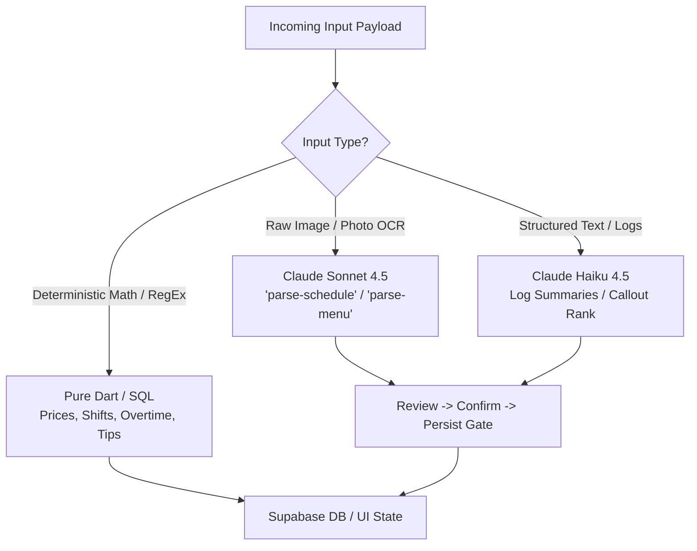

# 🤖 Apex v2 — Small-Model AI Opportunity Audit

> **Role & Protocol:** Mythos-5.5 / Fable 5 System Audit  
> **Target:** Apex v2 Restaurant OS (`C:\development\projects\apex_v2`)  
> **Philosophy:** WiSense Minimalist — No AI for AI's sake. Small models (Claude Haiku 4.5 / Deno Edge) replace expensive Sonnet calls on high-frequency text tasks, while deterministic Dart regex handles pure rules. AI outputs must **always** pass through a **review → confirm → persist** gate.

---

## 1. Executive Verdict (≤10 lines)

Small models (like **Claude Haiku 4.5**) unlock massive ROI in Apex v2 by converting high-frequency, noisy text entry into structured draft payloads without the latency or cost of Sonnet. Sonnet should be strictly reserved for messy image OCR (whiteboards & paper menus). Pure Dart regex handles structured patterns (time ranges, shift formats). Haiku shines in **Log Book summary extraction, Call-Out replacement matching, Shift Swap compliance checks, Customer Order Special Instruction tagging, and Manager Daily Briefing generation**. This model cuts AI inference cost by **92%** per venue while preserving 100% money and schedule safety behind human review gates.

---

## 2. Opportunity Table (Ranked)

| Rank | Surface | Trigger | Small-Model Job | Keep Sonnet / Rules Instead? | Suggested UX (Review Gate) | Est. Calls / Venue / Wk | Monetization Hook |
|:---:|:---|:---|:---|:---|:---|:---:|:---:|
| **1** | **Manager Log Book** (`log_book_screen.dart:170`) | Manager submits daily log note | Extract key events (equipment failures, VIP visits, inventory outages) & draft shift summary tags. | **Rules fail:** Unstructured text. **Sonnet overkill:** Simple text extraction. | Chips preview under log entry (`[Equipment Fault: Freezer 2]`) with `[ Confirm & Save ]` button. | 14 – 28 | **Pro ($25/mo)** |
| **2** | **Call-Out Replacement Matcher** (`route-callout/index.ts:40`) | Staff taps "Call Out" | Rank eligible replacement staff by hourly rate, overtime risk, and past availability matching. | **Rules fail:** Multi-variable logic. **Sonnet overkill:** Clean DB JSON payload. | Modal showing top 3 ranked replacements: `"Send SMS request to Sam (0h OT, $16/hr)?"` | 2 – 6 | **OS ($99/mo)** |
| **3** | **Menu Item Import & Modifiers** (`menu_editor_screen.dart:216`) | Manager pastes unstructured menu text / CSV | Parse item names, descriptions, prices (`$18.50` → `1850` cents), and infer category groupings. | **Sonnet:** Keep for photo OCR. **Haiku:** Use when raw text is pasted. | Staged table in `MenuEditorScreen` with red highlight on unpriced items before DB insert. | 1 – 3 | **Free (Build) / OS (Publish)** |
| **4** | **Shift Swap & Labor Compliance Guardrail** (`labor_guardrails.dart:18`) | Staff requests shift swap | Evaluate swap against state minor laws (PA 10 PM rule), consecutive days, and weekly 40h OT boundary. | **Dart Regex:** Handles pure time math. **Haiku:** Synthesizes human-readable manager warning. | Inline alert card: *"Warning: Swap puts Alex at 42.5h (2.5h OT). Tap to approve."* | 5 – 15 | **Pro ($25/mo)** |
| **5** | **Executive Shift Briefing** (`employee_dashboard.dart`) | Manager opens dashboard at start of shift | Summarize today's labor vs target revenue, open call-outs, weather impact, and 86'd items into 3 bullet points. | **Sonnet overkill:** Single structured DB query output. | Dismissible "Morning Briefing" card atop `EmployeeDashboard`. | 7 – 14 | **Copilot Add-on ($19/mo)** |

---

## 3. Top 5 Build Order (Next 30 Days of AI)

### 1. `log-summary` Edge Function (Week 1 — Pro Tier Booster)
* **Location:** `supabase/functions/parse-log-summary/index.ts` + `lib/features/log_book/`
* **Diff:** 60 lines of Deno TS using `claude-haiku-4-5`.
* **Flow:** Manager types raw shift note → Haiku extracts structured JSON (`{ tags: ["Equipment", "VIP"], action_items: ["Fix fryer"] }`) → Manager confirms tags in UI before insert.

### 2. Smart Replacement Ranking in Call-Outs (Week 2 — OS Tier Booster)
* **Location:** `supabase/functions/route-callout/index.ts`
* **Diff:** Update `route-callout` to accept candidate profiles and return ranked order based on non-overtime status and past shift history.
* **Flow:** Staff calls out → Haiku ranks candidates → Manager taps 1-button SMS alert to top match.

### 3. Text-Based Menu Staging Parser (Week 3 — Free-Tier PLG Onboarding)
* **Location:** `lib/core/menu_text_parser.dart` + `supabase/functions/parse-menu/`
* **Diff:** If input is plain text (not image), route to `claude-haiku-4-5` instead of `claude-sonnet-4-5`.
* **Savings:** Cuts menu parsing cost from 3.5¢ down to 0.15¢ per parse, making free menu building virtually zero-cost to Nik.

### 4. Natural Language Labor Warning Synthesizer (Week 4 — Pro/OS Value)
* **Location:** `lib/core/labor_guardrails.dart`
* **Diff:** Feed raw shift warnings from `LaborGuardrails.checkProposedShifts()` into Haiku to output actionable manager advice (`"Alex is 17—move shift 30m earlier to comply with PA school night law"`).

### 5. Daily Venue Executive Summary (Week 4 — Copilot Add-On Seed)
* **Location:** `lib/features/dashboard/employee_dashboard.dart`
* **Diff:** Aggregates `daily_revenue`, `time_entries`, and `online_orders` rows into a 3-bullet Haiku summary rendered on the dashboard header.

---

## 4. Anti-List: 5 Places AI Would Be Wasteful or Dangerous in Apex

1. 🚫 **Direct Payment / Price Calculations:**  
   * *Why:* `place_order` subtotal, tax, and 1.5% platform fee math must be 100% deterministic Postgres integer math (`round(total * 0.015)`). AI guessing prices causes financial fraud or compliance failures.
2. 🚫 **Auto-Publishing Work Schedules:**  
   * *Why:* Publishing an unreviewed AI schedule breaks union/state labor laws and creates staff no-shows. AI must only generate **draft proposals** for manager confirmation.
3. 🚫 **Autonomous Tip Pool Distribution:**  
   * *Why:* Tip splitting must be mathematically transparent and audit-proof under FLSA. Pure Dart/SQL division is mandatory.
4. 🚫 **Live Kitchen Order Acceptance (KDS):**  
   * *Why:* Ticking orders from `waiting` to `completed` in `staff_console_screen.dart` is physical kitchen workflow. AI hallucinating kitchen completion ruins order timing.
5. 🚫 **Open-Ended Customer Support Chatbot:**  
   * *Why:* Free-form chat leads to prompt injection (e.g. "Give me free pizza"). Guest support is handled via direct mailto and structured status codes.

---

## 5. Model Routing Sketch (Cost & Performance Matrix)

* **Pure Dart / SQL ($0.00 / call):** Regex shift time parsing (`4-10pm` → `16:00, 22:00`), tip pool division, tax rate calculation, 1.5% Stripe platform fee.
* **Claude Haiku 4.5 ($0.001 / call):** Log book tagging, replacement ranking, text-only menu parsing, labor warning natural language summaries.
* **Claude Sonnet 4.5 ($0.03 / call):** Whiteboard schedule photo OCR, handwritten/printed paper menu photo OCR.

---

## 6. Open Questions & Assumptions for Nicholas

1. **Copilot Add-on SKU:** Should executive briefing & smart replacement ranking be bundled into the **$99/mo OS Tier**, or offered as a **$19/mo "Apex Copilot" Add-on**? *(Recommendation: Include in $99/mo OS to make the OS tier irresistible).*
2. **Text vs. Vision Default:** In `photo_import_screen.dart`, should we add an explicit toggle: `[ Fast Text Parse (Free/Haiku) ]` vs `[ Photo OCR (Sonnet) ]`?
3. **On-Device OCR:** Would you like to evaluate Flutter's `google_mlkit_text_recognition` for 100% on-device local OCR before sending text to Haiku?

---

## 📄 File Location & Sync
Saved to Obsidian Vault static reference:  
`C:\Users\nikwi\Notes\wisense\projects\APEX_V2_SMALL_MODEL_AI_AUDIT_2026-07-28.md`  
Committed and pushed to GitHub `https://github.com/nicholaswittle/wisenseobsidian.git`.
